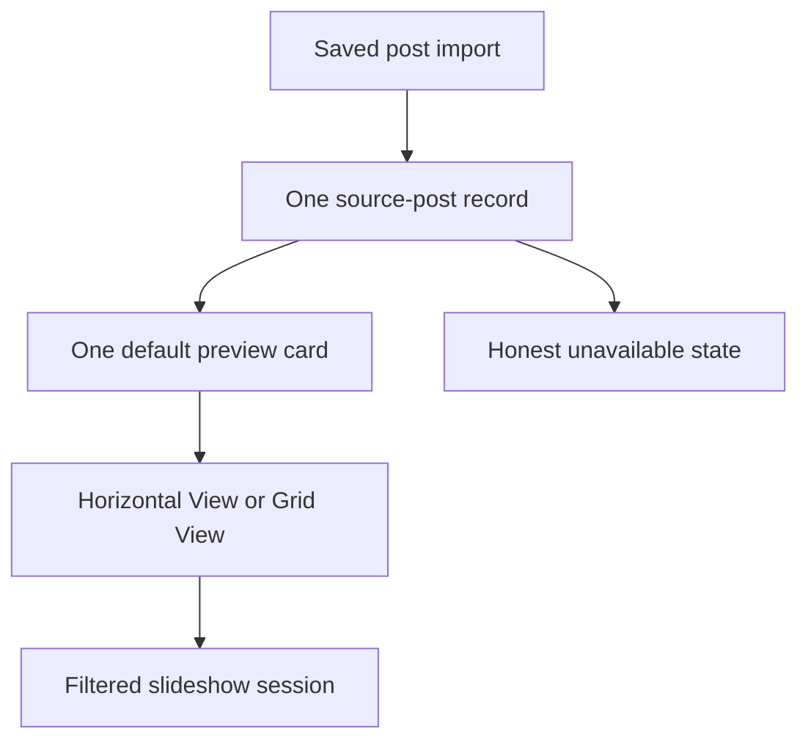

# Instagram Viewer Progress

Internal implementation tracker for `Instagram Viewer`.

## Current Product Direction

Build a local-first, media-first Instagram Saved photo viewer:

```text
Import saved_posts.json
        ↓
Extract Instagram `/p/` photo-post URLs
        ↓
Store local library in IndexedDB
        ↓
Enter Horizontal View or Grid View
        ↓
Filter + hide + configure + slideshow
```

The product remains one page with URL-backed Horizontal/Grid states, bottom sheets, and a full-viewport slideshow overlay. Browser Back and Forward restore the previous `?view=horizontal` / `?view=grid` state, while `?slideshow=1` keeps slideshow navigation in the same history model.

## Selected Direction: PhotoYoshi Archive Field

Status: **accepted MVP complete and browser-tested: one ordinary saved post maps to one default Instagram preview, with bounded ahead-of-viewport loading, persistent direct-image caching, smooth Horizontal View, and routed full-viewport slideshow**.

The accepted saved-JSON workflow intentionally produces one compatibility item per post. Instagram's default first preview is sufficient for this MVP; native carousel-child extraction is not a release requirement.



Approved product principles:

- Use `photoyoshi.com` as the visual reference: clipped display typography, deep black/plum canvas, centered imagery, sparse editorial metadata, and scroll-driven spatial motion.
- Make the empty state an upload-only composition rather than an application dashboard.
- After import, make the media field the product center and keep per-card metadata out of the visual surface.
- Replace the shortcode/date library list with a virtual Horizontal View and four-column desktop Grid View.
- Represent each ordinary saved post once and show Instagram's default first preview.
- Persist hide/downvote state per media item and keep it reversible.
- Search primarily by creator, collection, and local tags when those fields are available.
- Separate slideshow dwell time, transition duration, transition style, ordering, and looping.
- Keep the session dock visible at the bottom on desktop and mobile.
- Use Motion for component/interaction motion and GSAP for authored timelines; keep GPU/WebGL optional.
- Keep local-first privacy as the default and make every network/cache boundary explicit.
- Do not implement carousel extraction, thumbnails, or GPU media transitions by scraping Instagram or reading a cross-origin iframe.

## Revision 23: Unified Typography And Recognizable Controls

- [x] Self-host the Google Fonts Lobster typeface and its OFL license so production typography does not depend on a third-party font request.
- [x] Use Lobster as the single family for the title, tabs, buttons, sheets, form controls, labels, and status text; remove the previous system-font/Bodoni split.
- [x] Remove forced uppercase styling and hard-coded all-caps display copy, including the Landing wordmark, Slideshow action, and sheet labels, while preserving intentional acronym spelling such as JSON and RGB.
- [x] Give view tabs, Import, Filter, Settings, Slideshow, sheet actions, and slideshow controls one shared rounded dark-button language with a gradient edge and clear hover/focus states.
- [x] Make Previous, Play/Pause, and Next visible text controls instead of differently sized icon-only buttons; keep their font size, height, radius, and base styling identical.
- [x] Browser-verify one computed font family and one control size per viewport: desktop `19.2px / 52px / 16px`, mobile `16.32px / 46px / 14px`, with `text-transform: none` throughout.
- [x] Re-audit the four-task requirements document and retain passing coverage for URL history, global chrome/cursor, dense bounded media loading, rounded edges, five-second slideshow timing, known-child navigation, and interactive compatibility iframes.

## Revision 22: Interactive Five-Second Slideshow

- [x] Confirm the exact default dwell interval remains `5000ms` while preserving locally persisted user-configured values.
- [x] Keep resolved source media sorted by `sourceIndex`; manual Next and parent-page ArrowRight advance every known photo before the next post.
- [x] Use the existing session order after the final known photo: the next action and five-second timer advance to the next post, subject to the selected loop mode.
- [x] Rename resolved transport semantics to Previous/Next photo; unresolved compatibility embeds expose explicit Previous/Next post actions instead of pretending the parent controls their internal carousel.
- [x] Make slideshow iframes focusable, pointer-interactive, fullscreen-capable, and internally scrollable without an application overlay blocking native post or video controls.
- [x] Pause autoplay when the user focuses or points into the iframe; while an unresolved cross-origin embed is active, parent-page ArrowLeft/ArrowRight no longer skips the post.
- [x] Replace the clipped square iframe crop with a rounded, viewport-safe embed frame; browser QA measured the `1920 × 1080` frame at y=`92–988px` with `pointer-events: auto` and `tabIndex=0`.
- [x] Browser-verify a three-photo resolved slideshow at `03 / 03`, `5s`, `object-fit: contain`, and full `0–1080px` image bounds.

Confirmed cross-origin limitation: ordinary `saved_posts.json` does not enumerate carousel children. Users can operate Instagram's native in-iframe media controls, but the parent cannot read the active child, send a supported “next child” command, or make parent-page keyboard events advance that internal carousel. Automatic timing therefore applies to known queue items; for an unresolved embed that means the whole post, unless iframe interaction pauses playback.

## Revision 21: Denser Media Field And Triple Ahead Loading

- [x] Increase Horizontal media from `799px` to `870px` at `1920 × 1080`, reduce side gaps, and retain the existing smooth requestAnimationFrame wheel path.
- [x] Replace near-full-viewport Grid cards with square cards: desktop now shows two four-card rows while a third row remains mounted as bounded overscan (`12` cards maximum).
- [x] Allow compatibility previews only for currently visible cards plus the next three items, retain prepared permission while cards remain in the virtual window, and cap active iframe navigations at three.
- [x] Increase Horizontal overscan to three items so the complete ahead window can mount without making the full library resident.
- [x] Keep resolved photos at `object-fit: contain`; no application custom next-photo button is rendered in Horizontal or Grid.
- [x] Add consistent `22px` rounding, a `2px` near-black edge, an inset dark hairline, and a slight iframe overscan to cover application-controlled white seams.
- [x] Confirm through browser QA that selected and unselected cards use the same dark edge, Grid exposes `8` desktop / `2` mobile cards, and the final media remains reachable.

Confirmed platform boundary: a standard `saved_posts.json` item still resolves to a cross-origin Instagram embed. The parent can size and mask its container but cannot inspect its true media aspect ratio, restyle its internal carousel, guarantee removal of an iframe-internal white line, or force the first carousel child to fit differently.

## Revision 20: Prominent Global Viewer Controls

- [x] Move Horizontal View and Grid View from the bottom dock into two large top-center tabs with explicit active states.
- [x] Keep only `Instagram Viewer` in the header, make it decorative instead of navigational, and give it an italic Instagram-gradient treatment related to the Slideshow action.
- [x] Remove the `Local-first photo viewer` subtitle from both viewer and landing headers.
- [x] Increase primary desktop title, tab, import, and dock typography while using constrained mobile sizes that keep both long view labels readable.
- [x] Replace the oversized generated cursor with one native-size default cursor across application-controlled elements, including buttons, links, cards, disabled controls, and drag surfaces.
- [x] Confirm the active viewer contains no refresh/reload control; retain the documented browser boundary that CSS cannot override a cross-origin iframe's internal cursor.
- [x] Pass responsive screenshot QA at `1920 × 1080` Horizontal/Grid and `390 × 844` Grid without primary-control overlap.

## Revision 19: URL-Backed View Navigation

- [x] Represent Horizontal View as `?view=horizontal` and Grid View as `?view=grid` without adding a routing dependency.
- [x] Push a browser-history entry only when the selected view changes.
- [x] Synchronize the rendered view and active tab from `popstate` for repeated Back and Forward navigation.
- [x] Restore direct and refreshed Grid URLs, and normalize missing or unrecognized view values to the existing Horizontal default.
- [x] Preserve unrelated query parameters, hashes, smooth scrolling, and the existing slideshow history behavior.
- [x] Add a regression that traverses Grid → Horizontal → Grid, then Back twice and Forward twice.

## Revision 18: Pure Media, Smooth Navigation, Cache, And Routed Slideshow

- [x] Crop public Instagram embeds to the photo square so profile, follower, View more on Instagram, Like/Comment/Share/Save, counts, comments, and footer chrome are not visible.
- [x] Remove the selected-photo green border and replace the acid-green theme with an Instagram-inspired pink/orange/violet gradient.
- [x] Disable selection globally and add a generated transparent dark magenta/violet cursor asset.
- [x] Replace Horizontal View snap/direct wheel jumps with bounded requestAnimationFrame easing for vertical wheels and horizontal trackpads.
- [x] Keep Grid to the current four cards plus the next four and Horizontal to visible cards plus two neighbors on each side.
- [x] Retain up to 96 decoded direct photos, preload nearby direct assets, and register a cache-first image service worker where supported.
- [x] Make slideshow media occupy the complete viewport behind overlaid controls and remove source metadata from the image stage.
- [x] Push `?slideshow=1` on open, remove it on close, and react to `popstate` so browser Back returns to the photo field.
- [x] Verify known independent child-media records advance in source order before the next post.
- [x] Verify real public embeds, real mouse-wheel movement, Grid 4+4 loading, no-selection styling, no selected border, slideshow dimensions, and browser Back in the in-app browser.

## Revision 17: Silent Source Filtering And Bundle Split

- [x] Check visible saved posts through Meta's official tokenless Instagram oEmbed endpoint before mounting their iframe.
- [x] Silently remove posts reported as private, deleted, or non-embeddable; show no error card, error copy, or failed-post total.
- [x] Fall back to the iframe when the availability service itself is transiently unavailable or rate-limited, avoiding false exclusions.
- [x] Apply the same silent omission to terminal iframe timeouts/errors and exhausted direct-image fallbacks.
- [x] Split React, animation, data, and icon dependencies into production chunks; the largest JavaScript chunk is now `234.63 kB`.
- [x] Delete the unreferenced `artifacts/iteration-horizontal-check.png` screenshot.
- [x] Browser-import three synthetic saved posts with one official-check rejection and confirm exactly two cards/two iframes remain with no failure copy.

## Revision 15: Saved-JSON-Only Instagram Loading

- [x] Confirm the product's only user input is Instagram's exported saved-posts JSON; users are not expected to provide image files or a resolved manifest.
- [x] Remove the local-image manifest builder and its workflow documentation after the input requirement was clarified.
- [x] Verify from Meta's current official documentation that public embeds can display eligible posts, while the authenticated API is scoped to professional-account media and exposes no saved-post URL resolver.
- [x] Keep the two-request iframe concurrency limit, timeout teardown, and session failure memory.
- [x] Separate DOM overscan from network permission: mounted preload cards no longer contact Instagram before becoming visible.
- [x] Restrict desktop Grid compatibility requests to the visible row instead of eventually requesting all 12 mounted cards.
- [x] Restrict Horizontal compatibility requests to cards intersecting the real viewport plus any explicitly selected card, preventing offscreen overscan from taking request permits first.
- [x] Add component regressions for deferred enable/disable and an integration regression proving a 12-card Grid window creates only four visible-row embeds.
- [x] Import the ignored 6 MB real export in isolated Chrome with four-second deterministic embed responses: Horizontal mounted four cards but requested only its two visible previews; Grid mounted 12 cards but kept only four visible-row iframes; the next Grid row produced exactly four new requests; concurrency never exceeded two.

Accepted scope boundary:

- [x] The export has post URLs but no carousel-child URLs or image bytes. One default Instagram preview per post is the accepted result; independent carousel children are not required.

## Revision 16: MVP Acceptance And Release

- [x] Confirm one ordinary `saved_posts.json` record maps to one post card and one default first preview.
- [x] Remove native carousel-child extraction from the MVP acceptance criteria.
- [x] Retain bounded Horizontal/Grid rendering, visible-card-only iframe loading, and the two-request concurrency ceiling.
- [x] Complete unit, type, build, real-export browser, and responsive visual QA before release.

## Revision 14: Atomic Resolved-Media Manifest Import

- [x] Add a strict `instagram-viewer.resolved-media` V1 discriminator without changing ordinary `saved_posts.json` parsing.
- [x] Require a stable per-post media ID and derive deterministic IndexedDB identities that survive array reordering.
- [x] Flatten every manifest photo into an independent Horizontal/Grid queue item in source order.
- [x] Replace a referenced post's fallback or prior resolved set atomically while leaving unrelated posts unchanged.
- [x] Preserve media preferences for stable IDs across replacement and repeated imports.
- [x] Reject duplicate post/media identities, unsupported media types, insecure/private URLs, persistent-unsafe schemes, SVG data, oversized embedded images, and invalid dimensions.
- [x] Limit JSON imports to 120 MiB, individual data images to 10 MiB, and total embedded data media to 100 MiB.
- [x] Key direct-image and embed failure memory by media revision so an updated URL can retry instead of inheriting a stale failure.
- [x] Suppress referrer information for direct image requests and document the remaining remote-host network boundary.
- [x] Add fake IndexedDB parser/repository/importer integration coverage, including fallback replacement, idempotence, unrelated-post preservation, preference survival, and transaction rollback.
- [x] Browser-import a three-photo data manifest and verify three independent direct-image cards with stable IDs, source order, and zero iframes.
- [x] Capture the resolved manifest evidence at `artifacts/audit-04-manifest-grid.png`.

Remaining external-data gate:

- [x] The standard Instagram export contains no carousel child records or media bytes. The experimental internal manifest contract is retained for tests but is not an expected user workflow.

## Revision 13: Failure Containment And Browser-Proven Infinite Viewing

- [x] Make Grid View show exactly one four-card row per desktop viewport while retaining two prefetched rows and the 12-card DOM ceiling.
- [x] Keep one visible card per mobile Grid viewport with three cards mounted for the current plus two prefetched rows.
- [x] Unmount compatibility iframes that time out or fail, silently omit their cards, and remember terminal failures so virtual remounts do not retry them.
- [x] Prove timeout queue draining with fake timers: the active iframe navigation window remains bounded at two until all five test items reach a terminal state.
- [x] Add mixed-aspect and `390/1280/1920/3440` Horizontal layout coverage, including maximum-scroll reachability of the last media item.
- [x] Set the verified `1920 × 1080` Horizontal media height to `828px` (approximately 76.7% of the viewport).
- [x] Parse real `saved_posts.json` records atomically so repeated `value`/`href` URLs are counted once, Owner Username/Caption/Title/`fbid` metadata is preserved, and structural labels such as `URL` are not fabricated as collections.
- [x] Add repeatable local Chrome QA scripts for resolved-media visual states and the ignored real import file.
- [x] Capture current evidence at `artifacts/audit-01-horizontal.png`, `artifacts/audit-02-grid.png`, and `artifacts/audit-03-mobile-grid.png`.
- [x] In an isolated browser context, import the full local JSON in `946ms` while replacing Instagram with deterministic four-second delayed responses; the viewer mounted four cards, exposed no media/source totals, and never exceeded two concurrent embed navigations.

Known external-data gate:

- [x] The application can now ingest a legitimate local resolved-media manifest and replace fallback records atomically.
- [x] The actual export contains no carousel child records or media bytes; the confirmed product accepts this platform limitation instead of asking the user for a second source package.

## Revision 12: Readability And Bounded Media Loading

- [x] Restore the visible product name to `Instagram Viewer` on import, loading, and viewer surfaces.
- [x] Rename the browsing controls to `Horizontal View` and `Grid View`.
- [x] Increase functional text to 150% of the previous root scale.
- [x] Remove the oversized `YOUR ARCHIVE` watermark, session totals, progress totals, and left-side creator/collection identity from the active viewer.
- [x] Remove per-card creator/collection/frame labels, ordinal counters, Hide/Open Source actions, and source-count labels.
- [x] Keep all cards at full opacity and remove saturation, brightness, grayscale, and dark overlay treatments.
- [x] Use `object-fit: contain` so resolved photos remain fully visible.
- [x] Increase Horizontal View media to approximately 70–80% of the desktop viewport height.
- [x] Replace the full-library React/Motion map with a variable-width horizontal virtual window and an O(log n) centered-item lookup.
- [x] Make desktop Grid View exactly four columns and virtualize it to three mounted rows (12 cards maximum); use two columns on tablet and one on mobile.
- [x] Mount media only inside the active virtual window; eagerly request bounded direct images and limit compatibility iframe navigation starts to two at a time.
- [x] Fall back from a failed asset URL to its preview URL, then silently omit the item if both fail.
- [x] Crop compatibility iframes beyond both horizontal edges to reduce visible scrollbar/carousel-edge chrome; retain the documented cross-origin limitation because the parent cannot guarantee control of iframe internals.
- [x] Batch-create missing fallback media records during import instead of issuing two sequential IndexedDB operations per post.
- [x] Load demo media and persisted preferences through one generation-guarded snapshot, preventing hidden-item flash and stale async overwrites.
- [x] Stabilize the media refresh subscription and remove redundant post/media refresh calls after repository mutations.
- [x] Add long-library layout tests proving four columns, a 12-card Grid limit, a bounded Horizontal window, and full-track reachability.
- [x] Update HomePage tests to assert the new brand, mode names, independent media cards, and absence of rejected card controls/counts.
- [x] Verify Horizontal and Grid at `1920 × 1080` plus mobile Grid at `390 × 844`; store current evidence in the three `artifacts/audit-*` captures.

Known external-data gate:

- [x] Standard `saved_posts.json` records contain post URLs, not carousel children or media bytes. The saved-JSON-only product uses official embeds and does not promise native per-child cards.

## Revision 11: PhotoYoshi Archive Field

- [x] Capture desktop, scroll, pointer, and `390 × 844` mobile reference states from `photoyoshi.com`.
- [x] Replace the legacy white Instagram embed/list split with a full-viewport dark canvas.
- [x] Add an upload-first landing screen whose only primary task is selecting or dropping a saved-post JSON file.
- [x] Add a non-personal 19-frame demo route at `?demo=1`.
- [x] Flatten resolved source frames into one ordered horizontal ribbon.
- [x] Map vertical wheel input to horizontal archive movement.
- [x] Add per-frame creator, collection, frame position, hide, and source actions.
- [x] Add a contact-sheet Index mode without leaving the page.
- [x] Add creator, collection, text, and hidden-state filters in a bottom sheet.
- [x] Add dwell, transition duration, six transition presets, loop mode, and hidden-media recovery in a bottom sheet.
- [x] Keep slideshow controls and media inside the first viewport on desktop and mobile.
- [x] Limit unresolved Instagram iframes to the selected card and immediate neighbors.
- [x] Add/update 16 tests across 8 files.
- [x] Create same-viewport reference/implementation comparison evidence.
- [x] Pass `DESIGN-QA.md`, TypeScript checking, tests, and the production build.

Remaining work after this checkpoint:

- [x] Close the carousel-source investigation: the accepted MVP uses one default embed preview per saved post and requires no secondary media source.
- [x] Split the production bundle by React, animation, data, and icon dependencies so every JavaScript chunk stays below the build warning threshold.
- [x] Introduce bounded queue virtualization before profiling the full private library in the browser.
- [x] Profile the full private library after the user confirms the revised loading behavior.

## July 2026 Investigation Findings

- [x] Confirm the selected visual reference is the `Cinematic Lightbox` direction.
- [x] Confirm the existing text rows do not provide meaningful visual recognition.
- [x] Confirm saved time and shortcode should not be the primary browsing hierarchy.
- [x] Confirm the current slideshow advances by post rather than by every media item inside a carousel.
- [x] Confirm the future hide/downvote action must operate per media item, not only per source post.
- [x] Confirm the hide/downvote preference must persist independently of cache eviction.
- [x] Confirm creator search is more useful than shortcode search, provided creator metadata can be resolved.
- [x] Confirm the current three-value speed selector is too limited.
- [x] Confirm animation configuration needs separate dwell, transition, effect, order, and loop settings.
- [x] Confirm `saved_posts.json` does not contain carousel children, original media, or reliable thumbnails; confirm it does contain owner usernames and caption/title metadata that can be preserved without resolving media.
- [x] Confirm the parent app cannot inspect the Instagram iframe DOM or use its pixels for shader transitions because it is cross-origin.
- [x] Record the proposed Motion + GSAP + optional React Three Fiber stack.
- [x] Record the media acquisition decision gate before implementation.

## Revision 9: Cinematic Lightbox Design Specification

- [x] Document the selected dark Lightbox art direction.
- [x] Document the media-first domain model.
- [x] Document the visual queue replacing the current text library.
- [x] Document media-level hide/downvote and recovery behavior.
- [x] Document creator/collection/tag-oriented filtering.
- [x] Document customizable slideshow timing and transition presets.
- [x] Document the animation technology ownership boundaries.
- [x] Document browser cache, quota, eviction, and persistent-preference rules.
- [x] Document current iframe and JSON-source limitations.
- [x] Keep all July 2026 work documentation-only; do not change the application yet.

## Target Domain Model

The exact migration will be designed during implementation, but the next schema should separate source records, resolved media, preferences, cache, and playback configuration.

```ts
type SourcePost = {
  id: string;
  canonicalUrl: string;
  shortcode?: string;
  creatorHandle?: string;
  savedAt?: string;
  collectionNames: string[];
  mediaIds: string[];
  resolutionStatus: "unresolved" | "resolved" | "partial" | "unavailable";
};

type MediaItem = {
  id: string;
  sourcePostId: string;
  sourceIndex: number;
  type: "image" | "video";
  creatorHandle?: string;
  previewUrl?: string;
  assetUrl?: string;
  width?: number;
  height?: number;
  durationMs?: number;
};

type MediaPreference = {
  mediaId: string;
  visibility: "visible" | "hidden";
  rating: -1 | 0 | 1;
  hiddenAt?: string;
  localTags: string[];
};

type MediaCacheRecord = {
  mediaId: string;
  thumbnailBlobKey?: string;
  assetBlobKey?: string;
  byteSize: number;
  cachedAt: string;
  lastAccessedAt: string;
  status: "ready" | "stale" | "failed";
};

type PlaybackProfile = {
  id: string;
  name: string;
  creatorHandles: string[];
  collectionNames: string[];
  includeHidden: boolean;
  order: "source" | "newest" | "oldest" | "shuffle";
  dwellMs: number;
  transitionDurationMs: number;
  transitionPreset:
    | "crossfade"
    | "directional-wipe"
    | "depth-zoom"
    | "film-burn"
    | "rgb-split"
    | "ken-burns";
  loop: "off" | "session" | "source-post";
};
```

Rules:

- `MediaPreference` must survive thumbnail/media cache eviction.
- Deleting cache must not remove hidden/downvoted state, tags, or playback profiles.
- Re-import and source re-resolution must merge preferences by stable media identity.
- A hidden media item is excluded from normal sessions unless `includeHidden` is explicitly enabled.
- A temporary Skip action must not mutate `MediaPreference`.

## Target Information Architecture

### Primary Stage

- Full-height dark media surface.
- Media-level counter plus subtle source-post boundary.
- Quiet loading and silent omission for unavailable sources, with partial-resolution and offline behavior kept honest.
- Previous, play/pause, next, shuffle, loop, and session controls.
- Immediate Skip, Hide/Downvote, Undo, and Open Source actions.
- Controls fade when idle but return on pointer movement, focus, touch, or keyboard input.

### Visual Queue

- Replace the current shortcode/date list with a thumbnail filmstrip or compact contact sheet.
- Group media by source post without forcing post-level playback.
- Distinguish visible, hidden, cached, and uncached states without surfacing failed sources as cards.
- Keep text metadata secondary; creator and collection are more prominent than shortcode and save time.
- Keep the implemented virtual windows bounded, then tune row/card overscan after profiling a real large media library.
- Never render fake thumbnails when only an iframe URL is available.

### Session Builder

- Start a slideshow from all visible media, one creator, one or more collections, local tags, favorites, or a saved profile.
- Display the active session definition and item count before playback.
- Allow creator chips to become one-click `Play all from this creator` actions.
- Keep saved-date filtering as an advanced filter rather than the main browsing model.
- Keep shortcode lookup as a diagnostic/advanced filter.

### Hidden Media

- `H` or a thumbs-down control hides the current media item and advances immediately.
- Show a short Undo action after every hide.
- Provide a Hidden Media view to restore single or multiple items.
- Preserve the source post even when all its media items are hidden.
- Decide later whether downvote and hide remain one action or become separate rating and visibility concepts; the proposed schema supports both.

## Playback Engine Specification

- Dwell time and transition duration are independent values.
- Still-image dwell should support presets and a direct value/slider in roughly the `1–60 second` range.
- Transition duration should support approximately `150 ms–3 seconds`.
- The next media item should preload before the outgoing transition starts.
- Initial presets: Crossfade, Directional Wipe, Depth Zoom, Film Burn, RGB Split/Glitch, and Ken Burns.
- Sequential playback traverses every resolved media item in source order before advancing to the next source post.
- Shuffle operates on media items while preserving enough source metadata to show provenance.
- The engine pauses when the document becomes hidden unless the user explicitly chooses otherwise.
- Video timing, muted autoplay, and whether a video completes before advancing remain an open implementation decision.
- `prefers-reduced-motion` maps every spatial, glitch, zoom, and shader preset to a short opacity transition.
- Autoplay remains off by default.

## Animation And Graphics Architecture

| Owner                               | Planned use                                                                                                            | Boundary                                                                                                        |
| ----------------------------------- | ---------------------------------------------------------------------------------------------------------------------- | --------------------------------------------------------------------------------------------------------------- |
| Motion for React                    | UI presence, shared layout, queue reordering, gestures, drawers, focus/hover/tap feedback, and reduced-motion helpers. | Must not own media-stage timeline properties controlled by GSAP.                                                |
| GSAP + `@gsap/react`                | Stage transition timelines, progress scrubbing, complex masks/easing, effect sequencing, and deterministic cleanup.    | Must be scoped to the stage and cleaned up on media/session changes.                                            |
| React Three Fiber + post-processing | Optional WebGL ambience, particles, procedural grain, depth fields, light leaks, and shader transitions.               | Lazy-loaded enhancement only; requires direct CORS-safe or local media assets and must have a DOM/CSS fallback. |
| CSS                                 | Theme, typography, focus, contrast, responsive layout, idle-control states, and static fallbacks.                      | Remains the source of truth for non-animated presentation.                                                      |

Performance and accessibility budgets:

- Prefer transform and opacity for routine UI motion.
- Do not run the GPU render loop when the effects layer is not visible or motion is reduced.
- Regress device-pixel ratio or post-processing quality while interacting on constrained devices.
- Never require WebGL to import, filter, hide, restore, or play media.
- Maintain keyboard operation and visible focus even when controls visually fade.
- Avoid text blur, continuous parallax, or long entrance choreography during repeated browsing.

## Saved-JSON Media Boundary

The product path is confirmed: the user imports only `saved_posts.json`, and the viewer loads eligible posts through Instagram embeds. No second local image package is required.

- [x] Confirm which metadata is present in the Saved export and preserve the available owner/caption fields.
- [x] Confirm public embeds can display eligible posts without making users provide image files.
- [x] Confirm the official authenticated API does not resolve an arbitrary Saved-post collection for this static viewer.
- [x] Reject credentials pasted into the app, unofficial tokens, automated crawling, and silent bulk downloads.
- [x] Keep post-level iframe compatibility honest and restrict it to the real viewport.

Native thumbnails, independently flattened carousel children, and pixel-based effects remain unavailable unless Instagram provides those media assets through a future supported product path.

## Cache And Storage Plan

- [ ] Separate preference tables from blob cache tables.
- [ ] Estimate origin usage/quota through `navigator.storage.estimate()` where supported.
- [ ] Offer a clearly explained persistent-storage request through `navigator.storage.persist()` on secure deployments.
- [ ] Implement configurable cache limits and LRU eviction.
- [ ] Handle `QuotaExceededError` and recover by evicting nonessential blobs, never preferences.
- [ ] Expose storage usage, Clear Cache, and Clear Library as distinct actions.
- [x] Keep unavailable sources out of the browsing UI instead of presenting an error state.
- [ ] Verify re-import and schema migration never lose hide/downvote state.

## Revision 10: Media-First Cinematic Lightbox Checkpoint

- [x] Replace the active MVP screen with the selected black/graphite/amber/mint Lightbox shell.
- [x] Add deterministic `MediaItem` and persistent `MediaPreference` records to IndexedDB version 3.
- [x] Create one honest iframe-compatible media record for legacy/imported source posts.
- [x] Add a non-personal multi-source, multi-media demo fixture at `?demo=1`.
- [x] Replace shortcode-first browsing with the thumbnail Visual Queue for resolved media.
- [x] Traverse every resolved media item inside a source before advancing to the next source.
- [x] Add per-media Hide/Downvote, Undo, Hidden Media, restore, and restore-all.
- [x] Keep hidden preferences independent from demo assets and source-post visibility.
- [x] Add creator, collection, text/tag, and advanced saved-date session filters.
- [x] Add previous/next, play/pause, shuffle, source skip, session loop, source loop, and stop-at-end behavior.
- [x] Persist dwell, transition duration, transition effect, and loop settings.
- [x] Add Motion-powered sheets/queue feedback and GSAP-owned media-stage timelines.
- [x] Implement Crossfade, Directional Wipe, Depth Zoom, Film Burn, RGB Split, and Ken Burns presets.
- [x] Add keyboard-safe shortcuts and document-hidden playback pause.
- [x] Add responsive `1280×720` and `390×844` layouts without horizontal overflow.
- [x] Add media-queue and Lightbox interaction tests.
- [x] Run browser interaction tests for navigation, filtering, settings, hide, and restore.
- [x] Compare the selected reference and implementation in one combined QA artifact.
- [x] Pass `DESIGN-QA.md` with all observed P0/P1/P2 issues fixed.
- [x] Pass unit tests, TypeScript checking, and the production build.

Remaining architectural work is intentionally not hidden by this checkpoint:

- A legitimate media manifest or official authenticated resolver is still required for real carousel children, thumbnails, creator metadata, direct video playback, and pixel-based GPU effects.
- Blob-cache records, storage quota UI, LRU eviction, and Clear Cache remain future work.
- React Three Fiber/post-processing remains optional and has not been installed or shipped.
- The existing post-level `hidden` migration and a richer named playback-profile table still need explicit migration decisions.

## Long-Form Implementation Plan

### Phase 0: Source Feasibility

- [x] Complete the media acquisition decision gate by accepting one default embed preview per saved post.
- [x] Produce a non-personal fixture containing multiple source posts and multiple media items per post.
- [x] Prove deterministic media identity for the current source/index model.
- [x] Limit the first resolved-media checkpoint to still images while retaining a video-capable schema.

### Phase 1: Schema And Migration

- [ ] Add source-post, media-item, media-preference, cache-record, and playback-profile tables.
- [ ] Migrate existing `SavedPost.hidden` state conservatively.
- [x] Add media-preference repository methods and deterministic queue tests.

### Phase 2: Media Queue And Curation

- [x] Build the media-level playback sequence.
- [x] Add visual queue states and post grouping.
- [x] Add Skip, Hide/Downvote, Undo, Hidden Media, and restore flows.
- [x] Add creator/collection/tag session filters when metadata exists.

### Phase 3: Playback Engine

- [x] Add configurable dwell time, transition duration, ordering, and looping.
- [x] Add thumbnail/image preloading through the visual queue and document-hidden pause behavior.
- [x] Add keyboard shortcuts with input/select safety.
- [x] Persist the active playback settings; named multi-profile management remains future work.

### Phase 4: Cinematic Lightbox UI

- [x] Rebuild the shell with the selected black, graphite, projector-amber, and privacy-mint visual system.
- [x] Replace the MVP library with the visual queue.
- [x] Keep the loading state but replace terminal unavailable UI with silent omission.
- [x] Add responsive mobile queue access directly below the first-viewport stage.

### Phase 5: Motion And Effects

- [x] Establish Motion as the UI/layout animation layer.
- [x] Establish GSAP as the media-stage timeline layer.
- [x] Implement the accessible Crossfade preset first.
- [x] Add Directional Wipe, Depth Zoom, Film Burn, RGB Split, and Ken Burns.
- [ ] Evaluate React Three Fiber only after direct media assets and performance budgets are proven.

### Phase 6: Visual And Browser QA

- [ ] Test 1440×1024, 900px, 390px, and 320px layouts.
- [ ] Test keyboard-only playback, hide/undo, queue navigation, and focus restoration.
- [ ] Test reduced motion, zoom/reflow, high contrast, and screen-reader labels.
- [ ] Profile long sessions for memory leaks, dropped frames, cache pressure, and GPU fallback.
- [x] Compare implementation screenshots against the selected Cinematic Lightbox reference at the available desktop browser viewport.

## Privacy And Safety Rules

- [x] Ignore personal export files such as `saved_posts.json`.
- [x] Ignore `savepost.json` and common saved-post JSON filename variants.
- [x] Do not ask for Instagram username, password, 2FA, cookies, or unofficial tokens.
- [x] Do not automate crawling of Instagram Saved pages.
- [x] Do not bulk download Instagram media.
- [x] Treat the app as a local reference viewer, not a downloader.
- [x] Keep imported data out of GitHub Pages and any application backend.
- [x] Document that shared browser profiles share the same local IndexedDB.
- [x] Document Instagram iframe requests separately from local JSON processing.

## Revision 1: Initial Repository

- [x] Initialize git repository.
- [x] Create Vite React TypeScript project.
- [x] Add README.
- [x] Add PROGRESS tracker.
- [x] Add Dexie/IndexedDB data model.
- [x] Add URL parser for Instagram `/p/` photo-post URLs.
- [x] Add recursive JSON extractor.
- [x] Add ZIP importer.
- [x] Add first multi-page MVP.
- [x] Add unit tests.

## Revision 2: JSON-First Minimal UI

- [x] Add `saved_posts.json` / `savepost.json` gitignore rules.
- [x] Inspect actual `saved_posts.json` structure without exposing personal URL data.
- [x] Add direct JSON file importer.
- [x] Support the saved-post array shape with `timestamp`, `label_values`, `value`, and `href`.
- [x] Replace active multi-page routes with a single-page app.
- [x] Remove active nav tabs from the UI.
- [x] Remove active Settings page from the UI.
- [x] Keep import, library, and slideshow on one page.
- [x] Update README to match the simplified product.
- [x] Update PROGRESS after the revision.

## Revision 3: Viewer And Large-Library Repair

- [x] Replace script-mutated Instagram blockquotes with keyed embed iframes.
- [x] Track the selected post by stable post ID instead of list index.
- [x] Keep filtered, shuffled, clicked, and playing navigation on one playback order.
- [x] Repair previous, next, play, pause, and shuffle behavior.
- [x] Add selectable slideshow timing (6, 10, or 15 seconds).
- [x] Keep the active gallery focused on photo posts.
- [x] Add inclusive From/To saved-date filtering.
- [x] Load 20 library records initially.
- [x] Add infinite scrolling in groups of 20 with a manual fallback button.
- [x] Scroll the viewer into view when a library item is selected on stacked layouts.
- [x] Redesign the one-page UI for desktop, tablet, and mobile widths.
- [x] Add a reload action and original Instagram fallback per embed.
- [x] Add a development-only 45-item fixture for large-list browser QA.
- [x] Ignore likes, comments, and other Instagram social interactions.

## Revision 4: GitHub Pages And Browser Storage

- [x] Add a GitHub Actions workflow for GitHub Pages.
- [x] Build with a repository-specific Vite base path.
- [x] Configure the browser router to use Vite's deployment base URL.
- [x] Keep the production deployment completely static and backend-free.
- [x] Explain browser-local privacy boundaries and shared-profile risk.
- [x] Explain same-browser persistence and JSON re-import on another device.
- [x] Add setup instructions for maintainers and forks.
- [x] Confirm the first live GitHub Pages deployment.

## Revision 5: Photo-Only Product Scope

- [x] Restrict URL parsing and imports to Instagram `/p/` photo-post URLs.
- [x] Remove obsolete category state, filters, icons, labels, and styles.
- [x] Add an IndexedDB upgrade that removes previously stored unsupported records.
- [x] Remove the legacy category field from retained photo records.
- [x] Update fixtures, tests, README, and this tracker for the photo-only product.

## Revision 6: Project Rename

- [x] Rename the product to `Instagram Viewer` across the UI and project metadata.
- [x] Update documentation to the renamed GitHub repository.
- [x] Update the documented production URL and Pages build path.
- [x] Keep README content entirely in English.
- [x] Redeploy the renamed project through GitHub Pages.

## Revision 7: Simplified Local Data Flow

- [x] Remove app-generated data transfer controls from the active UI.
- [x] Delete the related implementation, data types, and tests.
- [x] Keep the imported library browser-local in IndexedDB with no backend database.
- [x] Re-import the original Instagram JSON on another browser or device.
- [x] Update README and this tracker to match the simplified workflow.

## Revision 8: Repository URL Update

- [x] Update repository links to `bradwang1995/Instagram-Viewer`.
- [x] Update the production URL and Pages build path casing.
- [x] Point the local Git remote at the renamed repository.
- [x] Redeploy the accumulated changes through GitHub Pages.

## Current Active UI

- [x] Upload-only empty-library composition with click and drag/drop import.
- [x] Horizontal, smooth wheel-driven virtual media view with approximately 70–80% viewport-height images and two-photo overscan on each side.
- [x] Four-column desktop Grid View with exactly one visible row plus one four-photo preload row (eight mounted cards maximum).
- [x] Creator, collection, local-text, and hidden-state filters.
- [x] Per-media hide/downvote plus hidden-media restoration.
- [x] Label-free, count-free photo cards with full-brightness `contain` rendering, hover lift/shadow, and no selected-photo border.
- [x] Configurable dwell time, transition duration, transition preset, and loop mode.
- [x] Full-viewport previous, play/pause, next, hide, settings, and close controls with an Instagram-inspired pink/orange/violet theme.
- [x] `?slideshow=1` browser history entry so Back returns to the photo field instead of leaving the app.
- [x] Global no-selection behavior plus a generated dark magenta/violet custom cursor.
- [x] Ahead-of-viewport direct-image preloading plus a cache-first browser service worker for previously loaded image requests.
- [x] Explicit iframe compatibility previews for unresolved posts.
- [x] Responsive bottom dock on desktop and mobile.
- [x] Non-personal `?demo=1` route containing 19 resolved media records.

## Tests

- [x] `parseInstagramUrl`
- [x] `extractPostsFromJson`
- [x] `extractPostsFromJson` for `saved_posts.json` array shape
- [x] `extractPostsFromHtml`
- [x] `mergeSavedPost`
- [x] Direct JSON importer integration test with fake IndexedDB
- [x] One-page UI selection/navigation/loading smoke test
- [x] Date range filtering test
- [x] Embed URL and wrapping navigation tests

## Latest Verification

- [x] `npm test` passes with 52 tests across 14 files.
- [x] `npm run build` passes.
- [x] `npm run lint` passes TypeScript checking.
- [x] Local dev server responds at `http://127.0.0.1:5173/`.
- [x] `git status --ignored` shows `saved_posts.json` as ignored.
- [x] Active router only serves the one-page `HomePage`.
- [x] Active header has a non-clickable gradient title and top-center Horizontal/Grid navigation tabs.
- [x] Long-library tests keep the desktop Grid DOM to twelve cards (three four-card rows) and the Horizontal DOM to a bounded visible/three-photo-overscan window.
- [x] Browser QA confirms `24px` root text, `user-select: none`, consistent `2px` dark card borders, hidden scrollbars, no horizontal scroll snap, two visible four-card desktop Grid rows plus bounded overscan, and last-media reachability.
- [x] Browser QA imports three resolved data images and confirms three ordered direct-image cards with stable IDs and no compatibility iframes.
- [x] Real vertical mouse-wheel input moved Horizontal View from `scrollLeft 0` to `676` and selected the next media without snap.
- [x] Creator filtering reduces the demo session to the expected five `@quietframes` media items.
- [x] Browser QA confirms button and keyboard next-photo actions advance every known frame before the next post.
- [x] Browser QA confirms no document overflow at `1280 × 720` or `390 × 844`.
- [x] Browser QA confirms slideshow controls, contained images, and the interactive iframe frame remain inside their viewports.
- [x] Browser QA confirms slideshow uses the full viewport, writes `?slideshow=1`, and browser Back restores the photo field without leaving the app.
- [x] Real public-embed QA visually hides Instagram's profile header, social actions, counts, comment field, and footer while retaining the photo surface.
- [x] Same-viewport PhotoYoshi/implementation comparison is stored at `artifacts/photoyoshi-mobile-comparison.png`.
- [x] Full findings and evidence are recorded in all-caps `DESIGN-QA.md`.

## Next Candidate Improvements

- [x] Add an automated direct JSON importer integration test with fake IndexedDB.
- [x] Add bounded virtualization to both browsing modes.
- [x] Profile the ignored real JSON in an isolated browser context with deterministic slow embeds; viewer ready in `1004ms`, Horizontal requested two visible previews, Grid limited 12 mounted cards to four visible-row iframes, the next row made four new requests, and navigation concurrency peaked at two.
- [x] Add timed silent omission and session failure memory for stalled/failed compatibility embeds.
- [x] Preserve per-child slideshow order whenever independent child-media records are available.
- [ ] Add optional manual URL paste only if needed.
- [ ] Consider opt-in authenticated sync only as a separate, security-reviewed product phase.

## Notes

- MVP v1 was committed as `9c31a75` and pushed to `origin/main`.
- Keep imported data browser-local unless a future phase explicitly designs authentication, authorization, encryption, retention, and deletion controls.
- Keep README and PROGRESS updated after each meaningful change.
