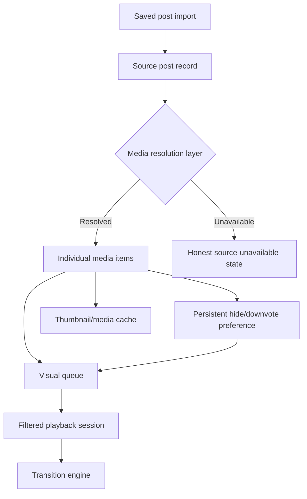

# Instagram Viewer Progress

Internal implementation tracker for `Instagram Viewer`.

## Current Product Direction

Build a very small local-first Instagram Saved photo viewer:

```text
Import saved_posts.json
        ↓
Extract Instagram `/p/` photo-post URLs
        ↓
Store local library in IndexedDB
        ↓
Browse + search + date filters
        ↓
Embedded photo viewer + slideshow
```

The product should remain one page unless a future requirement truly needs more.

## Selected Direction: Cinematic Lightbox

Status: **first media-first implementation checkpoint completed and browser-tested; media acquisition remains an open gate**.

The next major version is no longer a layout-only refresh. It changes the application's primary object from a saved Instagram post to an individual resolved media item.



Approved product principles:

- Use the dark, projector-amber `Cinematic Lightbox` concept as the visual baseline.
- Be design-heavy and animation-rich without making every element move continuously.
- Make the media stage the product center; treat metadata as supporting context.
- Replace the shortcode/date library list with a real visual queue when a legitimate thumbnail source exists.
- Flatten multi-photo source posts into media-level playback order.
- Persist hide/downvote state per media item and keep it reversible.
- Search primarily by creator, collection, and local tags when those fields are available.
- Separate slideshow dwell time, transition duration, transition style, ordering, and looping.
- Keep local-first privacy as the default and make every network/cache boundary explicit.
- Do not implement carousel extraction, thumbnails, or GPU media transitions by scraping Instagram or reading a cross-origin iframe.

## July 2026 Investigation Findings

- [x] Confirm the selected visual reference is the `Cinematic Lightbox` direction.
- [x] Confirm the existing text rows do not provide meaningful visual recognition.
- [x] Confirm saved time and shortcode should not be the primary browsing hierarchy.
- [x] Confirm the current slideshow advances by post rather than by every media item inside a carousel.
- [x] Confirm the future hide/downvote action must operate per media item, not only per source post.
- [x] Confirm the hide/downvote preference must persist independently of cache eviction.
- [x] Confirm creator search is more useful than shortcode search, provided creator metadata can be resolved.
- [x] Confirm the current three-value speed selector is too limited.
- [x] Confirm animation configuration needs separate dwell, transition, effect, order, and loop settings.
- [x] Confirm `saved_posts.json` does not contain carousel children, original media, reliable thumbnails, or creator metadata.
- [x] Confirm the parent app cannot inspect the Instagram iframe DOM or use its pixels for shader transitions because it is cross-origin.
- [x] Record the proposed Motion + GSAP + optional React Three Fiber stack.
- [x] Record the media acquisition decision gate before implementation.

## Revision 9: Cinematic Lightbox Design Specification

- [x] Document the selected dark Lightbox art direction.
- [x] Document the media-first domain model.
- [x] Document the visual queue replacing the current text library.
- [x] Document media-level hide/downvote and recovery behavior.
- [x] Document creator/collection/tag-oriented filtering.
- [x] Document customizable slideshow timing and transition presets.
- [x] Document the animation technology ownership boundaries.
- [x] Document browser cache, quota, eviction, and persistent-preference rules.
- [x] Document current iframe and JSON-source limitations.
- [x] Keep all July 2026 work documentation-only; do not change the application yet.

## Target Domain Model

The exact migration will be designed during implementation, but the next schema should separate source records, resolved media, preferences, cache, and playback configuration.

```ts
type SourcePost = {
  id: string;
  canonicalUrl: string;
  shortcode?: string;
  creatorHandle?: string;
  savedAt?: string;
  collectionNames: string[];
  mediaIds: string[];
  resolutionStatus: "unresolved" | "resolved" | "partial" | "unavailable";
};

type MediaItem = {
  id: string;
  sourcePostId: string;
  sourceIndex: number;
  type: "image" | "video";
  creatorHandle?: string;
  previewUrl?: string;
  assetUrl?: string;
  width?: number;
  height?: number;
  durationMs?: number;
};

type MediaPreference = {
  mediaId: string;
  visibility: "visible" | "hidden";
  rating: -1 | 0 | 1;
  hiddenAt?: string;
  localTags: string[];
};

type MediaCacheRecord = {
  mediaId: string;
  thumbnailBlobKey?: string;
  assetBlobKey?: string;
  byteSize: number;
  cachedAt: string;
  lastAccessedAt: string;
  status: "ready" | "stale" | "failed";
};

type PlaybackProfile = {
  id: string;
  name: string;
  creatorHandles: string[];
  collectionNames: string[];
  includeHidden: boolean;
  order: "source" | "newest" | "oldest" | "shuffle";
  dwellMs: number;
  transitionDurationMs: number;
  transitionPreset:
    | "crossfade"
    | "directional-wipe"
    | "depth-zoom"
    | "film-burn"
    | "rgb-split"
    | "ken-burns";
  loop: "off" | "session" | "source-post";
};
```

Rules:

- `MediaPreference` must survive thumbnail/media cache eviction.
- Deleting cache must not remove hidden/downvoted state, tags, or playback profiles.
- Re-import and source re-resolution must merge preferences by stable media identity.
- A hidden media item is excluded from normal sessions unless `includeHidden` is explicitly enabled.
- A temporary Skip action must not mutate `MediaPreference`.

## Target Information Architecture

### Primary Stage

- Full-height dark media surface.
- Media-level counter plus subtle source-post boundary.
- Honest loading, partial-resolution, unavailable, and offline states.
- Previous, play/pause, next, shuffle, loop, and session controls.
- Immediate Skip, Hide/Downvote, Undo, and Open Source actions.
- Controls fade when idle but return on pointer movement, focus, touch, or keyboard input.

### Visual Queue

- Replace the current shortcode/date list with a thumbnail filmstrip or compact contact sheet.
- Group media by source post without forcing post-level playback.
- Distinguish visible, hidden, unavailable, cached, and uncached states without relying only on color.
- Keep text metadata secondary; creator and collection are more prominent than shortcode and save time.
- Virtualize or window the queue only after profiling a real large media library.
- Never render fake thumbnails when only an iframe URL is available.

### Session Builder

- Start a slideshow from all visible media, one creator, one or more collections, local tags, favorites, or a saved profile.
- Display the active session definition and item count before playback.
- Allow creator chips to become one-click `Play all from this creator` actions.
- Keep saved-date filtering as an advanced filter rather than the main browsing model.
- Keep shortcode lookup as a diagnostic/advanced filter.

### Hidden Media

- `H` or a thumbs-down control hides the current media item and advances immediately.
- Show a short Undo action after every hide.
- Provide a Hidden Media view to restore single or multiple items.
- Preserve the source post even when all its media items are hidden.
- Decide later whether downvote and hide remain one action or become separate rating and visibility concepts; the proposed schema supports both.

## Playback Engine Specification

- Dwell time and transition duration are independent values.
- Still-image dwell should support presets and a direct value/slider in roughly the `1–60 second` range.
- Transition duration should support approximately `150 ms–3 seconds`.
- The next media item should preload before the outgoing transition starts.
- Initial presets: Crossfade, Directional Wipe, Depth Zoom, Film Burn, RGB Split/Glitch, and Ken Burns.
- Sequential playback traverses every resolved media item in source order before advancing to the next source post.
- Shuffle operates on media items while preserving enough source metadata to show provenance.
- The engine pauses when the document becomes hidden unless the user explicitly chooses otherwise.
- Video timing, muted autoplay, and whether a video completes before advancing remain an open implementation decision.
- `prefers-reduced-motion` maps every spatial, glitch, zoom, and shader preset to a short opacity transition.
- Autoplay remains off by default.

## Animation And Graphics Architecture

| Owner                               | Planned use                                                                                                            | Boundary                                                                                                        |
| ----------------------------------- | ---------------------------------------------------------------------------------------------------------------------- | --------------------------------------------------------------------------------------------------------------- |
| Motion for React                    | UI presence, shared layout, queue reordering, gestures, drawers, focus/hover/tap feedback, and reduced-motion helpers. | Must not own media-stage timeline properties controlled by GSAP.                                                |
| GSAP + `@gsap/react`                | Stage transition timelines, progress scrubbing, complex masks/easing, effect sequencing, and deterministic cleanup.    | Must be scoped to the stage and cleaned up on media/session changes.                                            |
| React Three Fiber + post-processing | Optional WebGL ambience, particles, procedural grain, depth fields, light leaks, and shader transitions.               | Lazy-loaded enhancement only; requires direct CORS-safe or local media assets and must have a DOM/CSS fallback. |
| CSS                                 | Theme, typography, focus, contrast, responsive layout, idle-control states, and static fallbacks.                      | Remains the source of truth for non-animated presentation.                                                      |

Performance and accessibility budgets:

- Prefer transform and opacity for routine UI motion.
- Do not run the GPU render loop when the effects layer is not visible or motion is reduced.
- Regress device-pixel ratio or post-processing quality while interacting on constrained devices.
- Never require WebGL to import, filter, hide, restore, or play media.
- Maintain keyboard operation and visible focus even when controls visually fade.
- Avoid text blur, continuous parallax, or long entrance choreography during repeated browsing.

## Media Acquisition Decision Gate

Implementation must begin with a time-boxed feasibility spike. The current iframe-only source cannot satisfy the target media model.

- [ ] Define the exact metadata and bytes needed for thumbnails, carousel children, creator search, media-level hiding, video playback, and GPU effects.
- [ ] Test whether a user-provided local manifest/media package can satisfy those requirements while preserving local-first privacy.
- [ ] Investigate an official authenticated resolver only if the local package is insufficient.
- [ ] Document authentication, permissions, rate limits, retention, deletion, and unavailable/private-content behavior before choosing a hosted resolver.
- [ ] Reject any approach that depends on credentials pasted into the app, unofficial tokens, automated crawling, or silent bulk downloads.
- [ ] Keep iframe-only mode as an explicit compatibility fallback, with post-level limitations clearly labeled.

No visual queue implementation should promise thumbnails until this gate is resolved.

## Cache And Storage Plan

- [ ] Separate preference tables from blob cache tables.
- [ ] Estimate origin usage/quota through `navigator.storage.estimate()` where supported.
- [ ] Offer a clearly explained persistent-storage request through `navigator.storage.persist()` on secure deployments.
- [ ] Implement configurable cache limits and LRU eviction.
- [ ] Handle `QuotaExceededError` and recover by evicting nonessential blobs, never preferences.
- [ ] Expose storage usage, Clear Cache, and Clear Library as distinct actions.
- [ ] Make cached, remote, unavailable, and local-only states visible in the UI.
- [ ] Verify re-import and schema migration never lose hide/downvote state.

## Revision 10: Media-First Cinematic Lightbox Checkpoint

- [x] Replace the active MVP screen with the selected black/graphite/amber/mint Lightbox shell.
- [x] Add deterministic `MediaItem` and persistent `MediaPreference` records to IndexedDB version 3.
- [x] Create one honest iframe-compatible media record for legacy/imported source posts.
- [x] Add a non-personal multi-source, multi-media demo fixture at `?demo=1`.
- [x] Replace shortcode-first browsing with the thumbnail Visual Queue for resolved media.
- [x] Traverse every resolved media item inside a source before advancing to the next source.
- [x] Add per-media Hide/Downvote, Undo, Hidden Media, restore, and restore-all.
- [x] Keep hidden preferences independent from demo assets and source-post visibility.
- [x] Add creator, collection, text/tag, and advanced saved-date session filters.
- [x] Add previous/next, play/pause, shuffle, source skip, session loop, source loop, and stop-at-end behavior.
- [x] Persist dwell, transition duration, transition effect, and loop settings.
- [x] Add Motion-powered sheets/queue feedback and GSAP-owned media-stage timelines.
- [x] Implement Crossfade, Directional Wipe, Depth Zoom, Film Burn, RGB Split, and Ken Burns presets.
- [x] Add keyboard-safe shortcuts and document-hidden playback pause.
- [x] Add responsive `1280×720` and `390×844` layouts without horizontal overflow.
- [x] Add media-queue and Lightbox interaction tests.
- [x] Run browser interaction tests for navigation, filtering, settings, hide, and restore.
- [x] Compare the selected reference and implementation in one combined QA artifact.
- [x] Pass `design-qa.md` with all observed P0/P1/P2 issues fixed.
- [x] Pass unit tests, TypeScript checking, and the production build.

Remaining architectural work is intentionally not hidden by this checkpoint:

- A legitimate media manifest or official authenticated resolver is still required for real carousel children, thumbnails, creator metadata, direct video playback, and pixel-based GPU effects.
- Blob-cache records, storage quota UI, LRU eviction, and Clear Cache remain future work.
- React Three Fiber/post-processing remains optional and has not been installed or shipped.
- The existing post-level `hidden` migration and a richer named playback-profile table still need explicit migration decisions.

## Long-Form Implementation Plan

### Phase 0: Source Feasibility

- [ ] Complete the media acquisition decision gate.
- [x] Produce a non-personal fixture containing multiple source posts and multiple media items per post.
- [x] Prove deterministic media identity for the current source/index model.
- [x] Limit the first resolved-media checkpoint to still images while retaining a video-capable schema.

### Phase 1: Schema And Migration

- [ ] Add source-post, media-item, media-preference, cache-record, and playback-profile tables.
- [ ] Migrate existing `SavedPost.hidden` state conservatively.
- [x] Add media-preference repository methods and deterministic queue tests.

### Phase 2: Media Queue And Curation

- [x] Build the media-level playback sequence.
- [x] Add visual queue states and post grouping.
- [x] Add Skip, Hide/Downvote, Undo, Hidden Media, and restore flows.
- [x] Add creator/collection/tag session filters when metadata exists.

### Phase 3: Playback Engine

- [x] Add configurable dwell time, transition duration, ordering, and looping.
- [x] Add thumbnail/image preloading through the visual queue and document-hidden pause behavior.
- [x] Add keyboard shortcuts with input/select safety.
- [x] Persist the active playback settings; named multi-profile management remains future work.

### Phase 4: Cinematic Lightbox UI

- [x] Rebuild the shell with the selected black, graphite, projector-amber, and privacy-mint visual system.
- [x] Replace the MVP library with the visual queue.
- [x] Add polished unavailable and loading states; explicit offline detection remains future work.
- [x] Add responsive mobile queue access directly below the first-viewport stage.

### Phase 5: Motion And Effects

- [x] Establish Motion as the UI/layout animation layer.
- [x] Establish GSAP as the media-stage timeline layer.
- [x] Implement the accessible Crossfade preset first.
- [x] Add Directional Wipe, Depth Zoom, Film Burn, RGB Split, and Ken Burns.
- [ ] Evaluate React Three Fiber only after direct media assets and performance budgets are proven.

### Phase 6: Visual And Browser QA

- [ ] Test 1440×1024, 900px, 390px, and 320px layouts.
- [ ] Test keyboard-only playback, hide/undo, queue navigation, and focus restoration.
- [ ] Test reduced motion, zoom/reflow, high contrast, and screen-reader labels.
- [ ] Profile long sessions for memory leaks, dropped frames, cache pressure, and GPU fallback.
- [x] Compare implementation screenshots against the selected Cinematic Lightbox reference at the available desktop browser viewport.

## Privacy And Safety Rules

- [x] Ignore personal export files such as `saved_posts.json`.
- [x] Ignore `savepost.json` and common saved-post JSON filename variants.
- [x] Do not ask for Instagram username, password, 2FA, cookies, or unofficial tokens.
- [x] Do not automate crawling of Instagram Saved pages.
- [x] Do not bulk download Instagram media.
- [x] Treat the app as a local reference viewer, not a downloader.
- [x] Keep imported data out of GitHub Pages and any application backend.
- [x] Document that shared browser profiles share the same local IndexedDB.
- [x] Document Instagram iframe requests separately from local JSON processing.

## Revision 1: Initial Repository

- [x] Initialize git repository.
- [x] Create Vite React TypeScript project.
- [x] Add README.
- [x] Add PROGRESS tracker.
- [x] Add Dexie/IndexedDB data model.
- [x] Add URL parser for Instagram `/p/` photo-post URLs.
- [x] Add recursive JSON extractor.
- [x] Add ZIP importer.
- [x] Add first multi-page MVP.
- [x] Add unit tests.

## Revision 2: JSON-First Minimal UI

- [x] Add `saved_posts.json` / `savepost.json` gitignore rules.
- [x] Inspect actual `saved_posts.json` structure without exposing personal URL data.
- [x] Add direct JSON file importer.
- [x] Support the saved-post array shape with `timestamp`, `label_values`, `value`, and `href`.
- [x] Replace active multi-page routes with a single-page app.
- [x] Remove active nav tabs from the UI.
- [x] Remove active Settings page from the UI.
- [x] Keep import, library, and slideshow on one page.
- [x] Update README to match the simplified product.
- [x] Update PROGRESS after the revision.

## Revision 3: Viewer And Large-Library Repair

- [x] Replace script-mutated Instagram blockquotes with keyed embed iframes.
- [x] Track the selected post by stable post ID instead of list index.
- [x] Keep filtered, shuffled, clicked, and playing navigation on one playback order.
- [x] Repair previous, next, play, pause, and shuffle behavior.
- [x] Add selectable slideshow timing (6, 10, or 15 seconds).
- [x] Keep the active gallery focused on photo posts.
- [x] Add inclusive From/To saved-date filtering.
- [x] Load 20 library records initially.
- [x] Add infinite scrolling in groups of 20 with a manual fallback button.
- [x] Scroll the viewer into view when a library item is selected on stacked layouts.
- [x] Redesign the one-page UI for desktop, tablet, and mobile widths.
- [x] Add a reload action and original Instagram fallback per embed.
- [x] Add a development-only 45-item fixture for large-list browser QA.
- [x] Ignore likes, comments, and other Instagram social interactions.

## Revision 4: GitHub Pages And Browser Storage

- [x] Add a GitHub Actions workflow for GitHub Pages.
- [x] Build with a repository-specific Vite base path.
- [x] Configure the browser router to use Vite's deployment base URL.
- [x] Keep the production deployment completely static and backend-free.
- [x] Explain browser-local privacy boundaries and shared-profile risk.
- [x] Explain same-browser persistence and JSON re-import on another device.
- [x] Add setup instructions for maintainers and forks.
- [x] Confirm the first live GitHub Pages deployment.

## Revision 5: Photo-Only Product Scope

- [x] Restrict URL parsing and imports to Instagram `/p/` photo-post URLs.
- [x] Remove obsolete category state, filters, icons, labels, and styles.
- [x] Add an IndexedDB upgrade that removes previously stored unsupported records.
- [x] Remove the legacy category field from retained photo records.
- [x] Update fixtures, tests, README, and this tracker for the photo-only product.

## Revision 6: Project Rename

- [x] Rename the product to `Instagram Viewer` across the UI and project metadata.
- [x] Update documentation to the renamed GitHub repository.
- [x] Update the documented production URL and Pages build path.
- [x] Keep README content entirely in English.
- [x] Redeploy the renamed project through GitHub Pages.

## Revision 7: Simplified Local Data Flow

- [x] Remove app-generated data transfer controls from the active UI.
- [x] Delete the related implementation, data types, and tests.
- [x] Keep the imported library browser-local in IndexedDB with no backend database.
- [x] Re-import the original Instagram JSON on another browser or device.
- [x] Update README and this tracker to match the simplified workflow.

## Revision 8: Repository URL Update

- [x] Update repository links to `bradwang1995/Instagram-Viewer`.
- [x] Update the production URL and Pages build path casing.
- [x] Point the local Git remote at the renamed repository.
- [x] Redeploy the accumulated changes through GitHub Pages.

## Current Active UI

- [x] Import JSON button.
- [x] Search field.
- [x] Saved-date range filter.
- [x] Infinite library list (20 items per batch).
- [x] Keyed Instagram iframe preview.
- [x] Previous and next controls.
- [x] Play/pause.
- [x] Shuffle.
- [x] Slideshow speed selector.
- [x] Open original Instagram post.
- [x] Clear local library from the same page.

## Tests

- [x] `parseInstagramUrl`
- [x] `extractPostsFromJson`
- [x] `extractPostsFromJson` for `saved_posts.json` array shape
- [x] `extractPostsFromHtml`
- [x] `mergeSavedPost`
- [ ] Direct JSON importer integration test with mocked IndexedDB
- [x] One-page UI selection/navigation/loading smoke test
- [x] Date range filtering test
- [x] Embed URL and wrapping navigation tests

## Latest Verification

- [x] `npm test` passes with 12 tests across 7 files.
- [x] `npm run build` passes.
- [x] The Pages-specific build emits `/Instagram-Viewer/` asset paths and router basename.
- [x] Local dev server responds at `http://127.0.0.1:5173/`.
- [x] `git status --ignored` shows `saved_posts.json` as ignored.
- [x] Active router only serves the one-page `HomePage`.
- [x] Active header has no navigation tabs.
- [x] Browser QA starts with exactly 20 of 45 demo records.
- [x] Scrolling automatically expands the rendered list from 20 to 40.
- [x] Browser QA confirms click selection and Next change the iframe target.
- [x] Browser QA confirms Play advances after 6 seconds and Pause stops playback.
- [x] Browser QA confirms search and date filters reduce the library.
- [x] Browser QA confirms no horizontal overflow at desktop or 390px mobile width.
- [x] A real local-export photo embed returns a visible photo without a login wall.

## Next Candidate Improvements

- [ ] Add an automated direct JSON importer integration test with mocked IndexedDB.
- [ ] Consider list virtualization only if many infinite-scroll batches become slow.
- [ ] Add a timed unavailable-preview message if Instagram changes embed behavior.
- [ ] Add optional manual URL paste only if needed.
- [ ] Consider opt-in authenticated sync only as a separate, security-reviewed product phase.

## Notes

- MVP v1 was committed as `9c31a75` and pushed to `origin/main`.
- Keep imported data browser-local unless a future phase explicitly designs authentication, authorization, encryption, retention, and deletion controls.
- Keep README and PROGRESS updated after each meaningful change.
