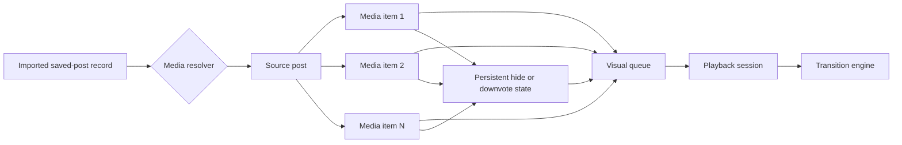

# Instagram Viewer

A local-first, image-first viewer for Instagram Saved posts. Import `saved_posts.json`, browse accessible posts in a horizontal or grid view, and run a configurable slideshow from one responsive page.

The current interface is a PhotoYoshi-inspired private archive: oversized editorial typography, a deep black/plum canvas, smooth horizontal image navigation, sparse chrome, and an always-available playback dock. It remains a personal reference viewer, not an Instagram downloader, scraper, or full data-export explorer.

Repository: [github.com/bradwang1995/Instagram-Viewer](https://github.com/bradwang1995/Instagram-Viewer)

Live app: [bradwang1995.github.io/Instagram-Viewer](https://bradwang1995.github.io/Instagram-Viewer/)

## Current Workflow

1. Export your Instagram Saved posts JSON.
2. Open the hosted app or run it locally.
3. Import `saved_posts.json` (or the equivalent saved-posts JSON filename in your export).
4. Browse the library or play the slideshow.

The app does not ask for Instagram credentials and does not upload your JSON file to GitHub, GitHub Pages, or an application server.

### What The Saved-Posts JSON Can Load

The export supplies Instagram post URLs and descriptive metadata, not direct image URLs or carousel-child records. Each imported post therefore becomes one card, and Instagram Viewer loads that post's default first preview directly from Instagram through its official embed page. The JSON itself remains in browser-local storage, while the embed necessarily makes a normal request to Instagram.

Compatibility requests use the same bounded preload window as the direct-photo experience. Horizontal View keeps the visible cards plus two neighbors on each side; Grid View keeps the visible four-card row plus the next four. Two compatibility requests may be in flight at once, so nearby photos warm progressively without creating an unbounded iframe burst.

An Instagram embed is a cross-origin document controlled by Instagram. The viewer clips its header and social footer outside the visible square, but cannot inspect or restyle the internal carousel, extract its child image URLs, or turn those children into separate parent-page cards. Meta's current API requires access tokens and is designed around media owned by authenticated professional accounts; it does not expose a saved-posts endpoint that resolves arbitrary saved URLs. The app does not use undocumented scraping endpoints or ask for Instagram credentials.

## Current Viewer Refinement

The active UI is branded `Instagram Viewer`. The app self-hosts the open-source Lobster typeface and uses it consistently for the non-clickable gradient wordmark, view tabs, buttons, sheets, form controls, and status text. Controls preserve their written capitalization instead of forcing all-caps. The two browsing modes remain large top-center tabs named `Horizontal View` and `Grid View`.

- Horizontal View uses a virtual media track: only visible photos and three neighboring items on each side are mounted. At `1920 × 1080`, the media surface is `870px` high, leaving only a small controlled gap between media and the overlaid page chrome.
- Grid View is four square columns on desktop and shows two compact rows in the active viewport. A third row remains mounted as bounded overscan, so a large desktop library keeps no more than twelve cards in the DOM; mobile keeps at most three.
- Direct images inside the active window load immediately and enter a retained decode window plus a cache-first image service worker where supported. Compatibility previews are permitted for visible cards plus the next three items, with at most three iframe navigations in flight. Meta's tokenless oEmbed check silently removes posts reported as private, deleted, or non-embeddable. Timeouts and terminal errors are also omitted without an error card or failure count.
- Resolved media is shown at normal brightness with `object-fit: contain`. Hover and selection use lift, scale, and shadow instead of dimming the other photos; selected photos have no colored border.
- Photo cards use a rounded near-black edge that stays visible against the page without a bright hairline. Per-card source labels, creator/collection captions, ordinal counters, custom next-photo buttons, Hide/Open Source buttons, and the Instagram social footer are absent. Instagram may still paint its native carousel arrow or an internal edge over the photo because the iframe's DOM is cross-origin.
- The full media list remains reachable through the virtual track, and both scrollbars stay visually hidden.
- Horizontal View and Grid View are represented by `?view=horizontal` and `?view=grid`. Switching modes adds an in-app history entry, so browser Back and Forward restore the matching URL, active tab, and rendered layout; direct view-specific URLs also restore on refresh.
- The page prevents text/image selection and keeps one native-size default cursor across application-controlled hover, click, and drag surfaces. A cross-origin Instagram iframe may still choose its own cursor internally because parent-page CSS cannot style the embedded document.
- Tabs, Import, Filter, Settings, Slideshow, sheet actions, and slideshow transport share one recognizable rounded dark-button treatment with a gradient edge. Desktop controls use the same `19.2px` font, `52px` height, and `16px` radius; the responsive mobile set uses the same `16.32px` font, `46px` height, and `14px` radius.
- Slideshow defaults to five seconds, fills the viewport behind overlaid controls, uses visible Previous/Play-or-Pause/Next labels, and pushes `?slideshow=1` so browser Back returns to the photo field. Known resolved children advance in source order before the next post; after the last known child, manual or timed navigation advances to the next post under the selected loop mode.

Ordinary `saved_posts.json` imports use one bounded compatibility preview per post because the export contains no child URLs. In Slideshow, that iframe is focusable, playable, scrollable, and left free of a blocking application overlay; focusing or pointing into it pauses autoplay. Users can operate Instagram's native carousel controls, but the parent cannot read or command the cross-origin carousel. Parent-page arrow keys therefore do not skip an unresolved interactive post, while explicit Previous/Next post buttons remain available. The app does not scrape Instagram or fabricate children from a cross-origin iframe.

## PhotoYoshi-Inspired Archive Field

> Implementation status: the full viewport archive-field redesign and viewport-scoped Instagram compatibility loading were implemented and browser-tested in July 2026. The standard export remains the only user input; failed previews disappear silently.

The selected direction treats the app as an animated editorial image field instead of a list beside an Instagram viewer. The empty state is deliberately simple: one full-screen composition whose primary action is importing the JSON export. After import, each saved post becomes one card in the virtual horizontal field, while Grid View provides a larger four-column contact sheet.

The bottom dock owns the session: Horizontal/Grid mode, filtering, playback settings, hidden-media recovery, and full-screen slideshow launch. Motion for React owns component/interaction motion and GSAP owns authored playback timelines.

### Implemented Checkpoint

- Replaced the old white Instagram stage and shortcode/date library split with a full-viewport black/plum media canvas.
- Added a JSON-only upload landing screen modeled on the PhotoYoshi composition without copying or hotlinking its media assets.
- Added a horizontal, wheel-driven media view and a four-column Grid View.
- Keeps the photo surface free of per-card labels, counters, source links, and curation controls.
- Keeps the bottom playback dock visible on desktop and mobile.
- Virtualizes both layouts so only the current viewport and bounded preload window mount media.
- Added IndexedDB `mediaItems` and `mediaPreferences` tables with deterministic media identity.
- Migrates existing source posts to honest iframe-compatible media records without fabricating carousel children or thumbnails.
- Added an ordered visual queue that gives every resolved source frame its own card.
- Added media-level Skip, Hide/Downvote, immediate Undo, Hidden Media, single restore, and restore-all flows.
- Added creator, collection, local-tag/text, and advanced saved-date session filtering.
- Added independent dwell time, transition duration, transition preset, shuffle, and loop behavior.
- Added Crossfade, Directional Wipe, Depth Zoom, Film Burn, RGB Split, and Ken Burns stage treatments.
- Added keyboard navigation and curation shortcuts, document-hidden playback pause, fullscreen, and reduced-motion fallbacks.
- Added an explicit `?demo=1` fixture with eight non-personal source posts and nineteen resolved media items to prove multi-photo source playback.
- Added responsive `1280 × 720` and `390 × 844` layouts, interaction tests, same-viewport comparison evidence, and a passing [`DESIGN-QA.md`](DESIGN-QA.md) report.

### Historical Investigation Findings

Before the media-first redesign, the MVP was structurally sound but its data and interface were organized around saved posts rather than individual media items. The findings below explain the redesign decisions; the active Horizontal/Grid surfaces no longer use the old text-list model.

- Shortcodes such as `DEMO001` and saved timestamps do not help users visually recognize a save.
- A text-only library row is a weak browsing model for an image-focused product.
- An unresolved carousel post is still one compatibility item because the export contains no child media. Resolved sources already advance through every supplied `MediaItem`.
- The existing `hidden` field applies to an entire saved post. The future product needs reversible hide/downvote state per photo or video.
- Search by shortcode has little everyday value. Search should prioritize creator, collection, and local tags once that metadata is available.
- The current speed selector exposes only three dwell times. Dwell time, transition duration, transition style, shuffle, and looping should become separate settings.
- An Instagram iframe can display a post, but it cannot provide the parent application with reliable access to each carousel item, its pixels, or its internal DOM because it is cross-origin.

### Product Model: Post Source, Media Playback

The source post remains useful for provenance, but it should no longer be the atomic playback item.



The intended sequence is therefore:

```text
Post A / media 1
Post A / media 2
Post A / media 3
Post B / media 1
...
```

Post provenance remains in the data model, while the browsing surfaces intentionally avoid post/media totals and ordinal labels.

### Target Workspace

The selected mock establishes the dark Lightbox shell, but the right-side text list is only a visual placeholder for the future queue.

- **Stage:** the dominant full-height media surface, with quiet loading and controls that never compete with the image; failed media is omitted.
- **Visual queue:** a virtual horizontal field or four-column Grid View, not a shortcode list. Every resolved media item is independently reachable.
- **Session builder:** clicking a creator, collection, or filter creates a slideshow session from the matching visible media.
- **Inspector:** provenance and advanced metadata stay available on demand instead of occupying every queue row.
- **Hidden media tray:** excluded items remain recoverable and auditable.
- **Command surface:** Import remains prominent; Clear Library stays in a protected overflow menu.

The visual queue may show thumbnails only when the application has a legitimate media source. It must not display fake placeholders that imply media has been downloaded or cached when it has not.

### Media-Level Curation

Every resolved media item should support three distinct actions:

- `Skip`: temporary; advances playback without changing future sessions.
- `Hide` / `Downvote`: persistent; removes that media item from normal browsing and playback and stores the preference locally.
- `Undo`: immediate recovery after hiding, followed by a dedicated Hidden Media view for later restoration.

The hide preference must be lightweight metadata stored separately from thumbnail or media blobs. Browser cache eviction must never silently restore disliked media to the slideshow.

Suggested keyboard interactions:

- `Left` / `Right`: previous or next media item.
- `Space`: play or pause when focus is not inside a form control.
- `H`: hide the current media item.
- `U`: undo the most recent hide.
- `S`: skip the remaining media in the current source post.
- `Escape`: stop playback or close the active overlay.

All shortcuts need visible discovery, focus-safe behavior, and a reduced-motion path.

### Search And Session Filters

The primary search target should become the creator handle once a media resolver can provide it. Collection and local tags remain useful. Shortcode can remain available as an advanced diagnostic field rather than the main search promise.

Recommended filter order:

1. Creator/author.
2. Instagram collection.
3. Local tags and favorites.
4. Visible/hidden status.
5. Saved-date range.
6. Source shortcode as an advanced filter.

Semantic image search is not part of the next implementation phase. It would require actual media assets plus a separate local or hosted vision-indexing design.

### Playback And Transition Design

Playback timing should separate how long media remains visible from how it transitions:

- Dwell time: preset buttons plus a direct value or slider, approximately `1–60 seconds` for still images.
- Transition duration: approximately `150 ms–3 seconds`.
- Transition preset: Crossfade, Directional Wipe, Depth Zoom, Film Burn, RGB Split/Glitch, and Ken Burns for still images.
- Ordering: sequential, shuffle, or filtered session order.
- Looping: off, session loop, or current-source-post loop.
- Preloading: prepare at least the next media item before beginning the transition.
- Background behavior: pause when the page is hidden and resume only according to the user's setting.

`prefers-reduced-motion` must replace spatial, zoom, glitch, and shader transitions with a short opacity transition. Autoplay remains off by default.

### Animation And Graphics Stack

The proposed stack deliberately gives each layer one owner:

| Layer                | Proposed technology                                                 | Responsibility                                                                                                                                                 |
| -------------------- | ------------------------------------------------------------------- | -------------------------------------------------------------------------------------------------------------------------------------------------------------- |
| Interface motion     | [Motion for React](https://motion.dev/docs/react)                   | Component enter/exit, queue reordering, shared layout, gestures, drawers, focus-aware micro-interactions, and reduced-motion behavior.                         |
| Cinematic timelines  | [GSAP](https://gsap.com/docs/v3/) with `@gsap/react`                | Deterministic stage timelines, transition choreography, playhead scrubbing, masks, complex easing, and effect sequencing.                                      |
| Optional GPU layer   | [React Three Fiber](https://r3f.docs.pmnd.rs/) plus post-processing | Ambient particles, procedural grain, light leaks, shader wipes, depth fields, and other graphics that need WebGL. This layer must be lazy-loaded and optional. |
| Static visual system | CSS custom properties and authored CSS                              | Dark theme, projector-amber emphasis, typography, contrast, focus, responsive layout, and non-animated fallbacks.                                              |

Motion and GSAP should not animate the same property on the same element. Motion owns application UI and layout; GSAP owns the media-stage timeline. React Three Fiber is an enhancement layer, not the foundation of navigation or accessibility.

The current project uses React 18, so any React Three Fiber implementation must use a compatible major version or upgrade React deliberately. GPU effects should reduce resolution or disable expensive post-processing on constrained devices.

### Confirmed Instagram Source Path

The only user input is Instagram's exported `saved_posts.json`. It supplies post URLs, timestamps, owner usernames, captions/titles, hashtags, and platform record IDs. It does **not** include the original image bytes, carousel-child URLs, reliable thumbnails, or CORS-safe media assets. The importer deduplicates repeated `value`/`href` URLs, preserves the available owner/caption metadata, and avoids treating structural labels such as `URL` as collections.

The selected credential-free path is Instagram's public embed for each eligible post. [Instagram's embed documentation](https://www.facebook.com/help/instagram/620154495870484) states that only public content with embedding enabled can be embedded. The app therefore loads from Instagram at viewing time; it does not ask the user for local image files or a resolved-media manifest. Compatibility embeds are limited to the real viewport and two concurrent navigations.

The embedded Instagram page can present its own carousel controls when Instagram permits it, but it remains cross-origin. The viewer cannot inspect that page, extract each child as an independent native card, remove controls inside it with certainty, or use its pixels for WebGL effects. The [official Meta Instagram API collection](https://www.postman.com/meta/instagram/collection/6yqw8pt/instagram-api) documents an access-token flow for Professional accounts; it is not a resolver for arbitrary URLs in a user's Saved export. Automated scraping, unofficial tokens, credentials pasted into the app, and silent bulk downloading remain outside the product boundary.

### Cache And Preference Persistence

If a future media source permits thumbnails or local assets:

- Keep canonical preferences such as hidden/downvoted state, local tags, and playback profiles in IndexedDB metadata tables.
- Store thumbnail/media blobs in a separate cache table with size, last-accessed time, and source status.
- Use an LRU eviction policy and never couple preference deletion to blob eviction.
- Use the browser Storage API to report estimated usage/quota and optionally request persistent storage on HTTPS deployments.
- Expose Clear Cache separately from Clear Library.
- Make cache size and network behavior visible to the user; never imply that an iframe preview is stored locally.

The redesign remains local-first by default. Any future backend or authenticated resolver is a separate product and security decision, not an incidental implementation detail.

## What It Does

- Imports Instagram Saved post JSON directly and keeps photo-post references only.
- Supports the `saved_posts.json` array shape with `timestamp`, `label_values`, `value`, and `href` fields.
- Extracts Instagram `/p/` photo-post URLs.
- Canonicalizes and deduplicates photo references.
- Stores the local library in IndexedDB.
- Builds a media-level queue while retaining each source post for provenance.
- Shows resolved thumbnails when legitimate media assets exist and an honest source tile when they do not.
- Searches creators, collections, captions, local tags, and advanced saved dates.
- Uses Instagram's dedicated embed page as a compatibility mode for unresolved source posts.
- Plays every resolved frame in source order before advancing to the next source post.
- Supports previous, next, play, pause, shuffle, source skip, session/source looping, and `1–60s` dwell timing.
- Supports six cinematic transition presets with independently configurable duration.
- Hides/downvotes individual media items, persists the preference locally, and supports immediate or later restoration.
- Includes an explicit cinematic demo mode at `?demo=1` without mixing demo posts into the user's library.
- Adapts to desktop, tablet, and mobile widths without horizontal scrolling.
- Retains the canonical Instagram post URL locally as source provenance without placing an Open Source control on every photo.
- Ignores personal export JSON files by default.

## What It Avoids

- Instagram login.
- Passwords, 2FA codes, cookies, or unofficial tokens.
- Automated browser crawling.
- Private API scraping.
- Bulk media downloading.
- Cloud sync.
- Multi-tab product-style UI.

## Privacy And Data Ownership

There is no application backend, account system, client ID, or session database. GitHub Pages serves the same static HTML, CSS, and JavaScript files to everyone. When a visitor selects a JSON file, the app reads it in that browser and writes the extracted library to IndexedDB under the site's origin.

This means:

- A visitor on another device or browser profile cannot read your IndexedDB library.
- GitHub Pages does not receive the selected JSON file or the IndexedDB records.
- The original JSON file is not added to this repository or a remote database.
- Someone using the same operating-system account and browser profile can open the same local library. Use a separate browser profile on a shared computer.
- Clearing site data, using a private window, browser storage eviction, or changing to a different site origin can remove or separate access to the library.
- The app's own JavaScript can access its IndexedDB data. Use a deployment whose source and owner you trust.

The local database contains canonical Instagram photo-post URLs, shortcodes, timestamps, collection names, and import summaries. Personal export filenames such as `saved_posts.json` and `savepost.json` are ignored by git.

Instagram previews are loaded in iframes from `instagram.com`. Opening a preview sends that post URL and normal browser request information to Instagram, just as opening an Instagram embed normally would. The export JSON itself is not sent with that request.

## Browser Storage

On the same browser profile and the same site origin, the gallery loads automatically from IndexedDB on future visits. There is no login because no server owns a copy of the library.

Direct photo assets are preloaded ahead of the current viewport and retained in a small decoded-image window. Supported browsers also register a local cache-first service worker for image requests, so revisiting a previously loaded direct photo does not require the viewer to start from zero. Grid View mounts at most three four-photo rows; Horizontal View retains the visible photos plus three-photo overscan on each side. Compatibility iframe permission is limited to visible cards plus the next three items, with three active navigations at most.

Instagram compatibility previews are cross-origin iframe documents. The viewer can keep nearby previews mounted, but it cannot place Instagram's iframe document itself into the app's image cache or control Instagram's own cache headers.

If you use another browser or device, clear site data, or move the app to another origin, select the original Instagram `saved_posts.json` again. The app intentionally has no cross-device transfer or recovery workflow.

Cross-device sync would require user authentication, access controls, secure server storage, deletion controls, and a documented privacy policy. That is intentionally outside the current local-first viewer.

## Preview Availability

The JSON export contains Instagram links and descriptive metadata, not the original photo files. Those imports therefore use Instagram's public embed page as a bounded compatibility preview; no additional user-supplied image package is part of the workflow.

- Public and available photo posts can render directly in the viewer.
- Private, removed, age-restricted, login-gated, or non-embeddable posts are silently omitted.
- Direct images fall back from the asset URL to the preview URL; if both fail, the item is silently omitted.

The viewer shows neither an error card nor a failed-post total. If Meta's availability check itself is temporarily rate-limited or unreachable, the viewer falls back to the normal Instagram iframe rather than incorrectly discarding the post.

The app does not read likes or comments and does not recreate Instagram's social interface.

The compatibility iframe is clipped to its media square. Its profile header, follower information, View more on Instagram link, Like / Comment / Share / Save controls, like count, comment field, and Instagram footer remain outside the visible card and slideshow area. Instagram may still draw a carousel arrow over the photo itself.

When imported data contains independent child-media records, slideshow navigation advances each child in source order before moving to the next post. Ordinary Instagram `saved_posts.json` does not contain carousel-child URLs, and the parent app cannot inspect or automatically click a cross-origin embed carousel; those ordinary records therefore retain one default compatibility frame per saved post.

## Getting Started

Install dependencies:

```bash
npm install
```

Run the local app:

```bash
npm run dev
```

Build:

```bash
npm run build
```

Test:

```bash
npm test
```

## GitHub Pages Deployment

The repository includes [`.github/workflows/deploy-pages.yml`](./.github/workflows/deploy-pages.yml). It runs the test suite, builds Vite with the repository name as its base path, and deploys `dist` whenever `main` is pushed. The project remains a static site; no personal viewer data is included in the deployment artifact.

One repository setting is required:

1. Open **Settings → Pages** in the GitHub repository.
2. Under **Build and deployment**, set **Source** to **GitHub Actions**.
3. Push to `main`, or open **Actions → Deploy to GitHub Pages → Run workflow**.
4. After the workflow succeeds, use the URL shown in its `github-pages` deployment.

For a fork, the workflow calculates `/<repository-name>/` automatically. No source edit is needed as long as the fork is deployed as a normal GitHub project page.

To inspect the exact Pages build locally:

```bash
npm ci
npm test
npm run lint
npx --no-install vite build --base="/Instagram-Viewer/"
```

The generated static site is in `dist/`. The checked-in workflow is the recommended deployment path because Vite requires a build step.

## Local Development

There is also a Windows helper script for this workspace:

```bash
scripts\dev-server.cmd
```

Then open:

```text
http://127.0.0.1:5173/
```

## Project Shape

```text
src/
  app/                  App shell and single route
  pages/HomePage.tsx    One-page JSON import, library, and slideshow
  db/                   Dexie schema and local repositories
  features/import/      JSON, ZIP, HTML, and URL import logic
  features/library/     Filtering and sorting
  features/slideshow/   Navigation and shuffle helpers
  dev/                   Development-only large-library fixture
  components/           Reusable UI pieces
  tests/                Unit tests
```

The ZIP importer and some richer components still exist in the codebase as reusable pieces, but the active UI is saved-JSON-first and one-page. `/?demo=1` opens a bundled non-personal direct-image fixture for UI testing; `/?demo=1&view=grid` opens the same fixture directly in Grid View.

## Current Status

The accepted MVP is a responsive one-page Saved-post viewer with one default compatibility preview per ordinary saved post, bounded ahead-of-viewport loading, a four-column desktop grid, smooth wheel-driven Horizontal View, a full-viewport slideshow with browser history, persistent browser-local storage and image caching, and automated GitHub Pages deployment. See [PROGRESS.md](./PROGRESS.md) for the internal tracker.
