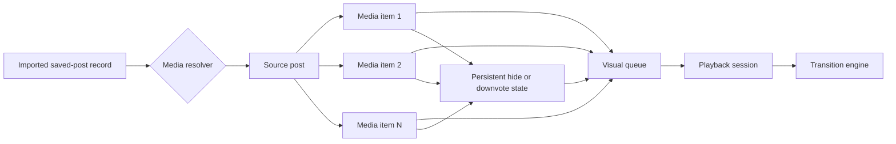

# Instagram Viewer

A local-first viewer for Instagram Saved photos. Import `saved_posts.json`, browse a large saved-photo library, and run a photo slideshow from one responsive page.

The application now ships its first media-first `Cinematic Lightbox` checkpoint. It remains a personal saved-photo reference viewer, not an Instagram downloader, scraper, or full data-export explorer.

Repository: [github.com/bradwang1995/Instagram-Viewer](https://github.com/bradwang1995/Instagram-Viewer)

Live app: [bradwang1995.github.io/Instagram-Viewer](https://bradwang1995.github.io/Instagram-Viewer/)

## Current Workflow

1. Export your Instagram Saved posts JSON.
2. Open the hosted app or run it locally.
3. Import `saved_posts.json`.
4. Browse the library or play the slideshow.

The app does not ask for Instagram credentials and does not upload your JSON file to GitHub, GitHub Pages, or an application server.

## Cinematic Lightbox Redesign

> Implementation status: the first media-first Lightbox checkpoint was implemented and browser-tested in July 2026. Legitimate carousel/media resolution remains the next external-data gate; iframe-only imports continue in an explicitly labeled compatibility mode.

The selected direction is a dark, immersive `Cinematic Lightbox`: the media stage should feel like a private screening room rather than a generic list-and-preview utility. The redesign is intentionally design-heavy and animation-rich, with a restrained black interface, projector-amber highlights, expressive transitions, and a visual queue that supports fast curation.

The goal is not to add motion everywhere. The goal is **heavy art direction with purposeful motion**: the current media, playback state, selection, filtering, and destructive actions should each have a clear visual response, while reading, focus, and media playback remain stable.

### Implemented Checkpoint

- Added IndexedDB `mediaItems` and `mediaPreferences` tables with deterministic media identity.
- Migrates existing source posts to honest iframe-compatible media records without fabricating carousel children or thumbnails.
- Added a thumbnail-based Visual Queue for resolved media and source-group frame counts.
- Added media-level Skip, Hide/Downvote, immediate Undo, Hidden Media, single restore, and restore-all flows.
- Added creator, collection, local-tag/text, and advanced saved-date session filtering.
- Added independent dwell time, transition duration, transition preset, shuffle, and loop behavior.
- Added Crossfade, Directional Wipe, Depth Zoom, Film Burn, RGB Split, and Ken Burns stage treatments.
- Added keyboard navigation and curation shortcuts, document-hidden playback pause, fullscreen, and reduced-motion fallbacks.
- Added an explicit `?demo=1` fixture with eight non-personal source posts and nineteen resolved media items to prove multi-photo source playback.
- Added responsive desktop/mobile layouts, interaction tests, browser screenshots, and a passing [`design-qa.md`](design-qa.md) report.

### Investigation Findings

The current MVP is structurally sound, but its data and interface are organized around saved posts when the desired experience is organized around individual media items.

- Shortcodes such as `DEMO001` and saved timestamps do not help users visually recognize a save.
- A text-only library row is a weak browsing model for an image-focused product.
- A carousel post is treated as one slideshow item, so playback advances from the first visible carousel frame directly to the next post instead of traversing every image in the carousel.
- The existing `hidden` field applies to an entire saved post. The future product needs reversible hide/downvote state per photo or video.
- Search by shortcode has little everyday value. Search should prioritize creator, collection, and local tags once that metadata is available.
- The current speed selector exposes only three dwell times. Dwell time, transition duration, transition style, shuffle, and looping should become separate settings.
- An Instagram iframe can display a post, but it cannot provide the parent application with reliable access to each carousel item, its pixels, or its internal DOM because it is cross-origin.

### Product Model: Post Source, Media Playback

The source post remains useful for provenance, but it should no longer be the atomic playback item.



The intended sequence is therefore:

```text
Post A / media 1
Post A / media 2
Post A / media 3
Post B / media 1
...
```

Post boundaries remain visible as subtle separators and provenance, but the slideshow counter should primarily report media progress, for example `Media 132 of 981 · Post 48 of 220`.

### Target Workspace

The selected mock establishes the dark Lightbox shell, but the right-side text list is only a visual placeholder for the future queue.

- **Stage:** the dominant full-height media surface, with honest unavailable/loading states and controls that never compete with the image.
- **Visual queue:** a thumbnail filmstrip or compact contact sheet, not a shortcode list. It should show post grouping without forcing the user to think in post records.
- **Session builder:** clicking a creator, collection, or filter creates a slideshow session from the matching visible media.
- **Inspector:** provenance and advanced metadata stay available on demand instead of occupying every queue row.
- **Hidden media tray:** excluded items remain recoverable and auditable.
- **Command surface:** Import remains prominent; Clear Library stays in a protected overflow menu.

The visual queue may show thumbnails only when the application has a legitimate media source. It must not display fake placeholders that imply media has been downloaded or cached when it has not.

### Media-Level Curation

Every resolved media item should support three distinct actions:

- `Skip`: temporary; advances playback without changing future sessions.
- `Hide` / `Downvote`: persistent; removes that media item from normal browsing and playback and stores the preference locally.
- `Undo`: immediate recovery after hiding, followed by a dedicated Hidden Media view for later restoration.

The hide preference must be lightweight metadata stored separately from thumbnail or media blobs. Browser cache eviction must never silently restore disliked media to the slideshow.

Suggested keyboard interactions:

- `Left` / `Right`: previous or next media item.
- `Space`: play or pause when focus is not inside a form control.
- `H`: hide the current media item.
- `U`: undo the most recent hide.
- `S`: skip the remaining media in the current source post.
- `Escape`: stop playback or close the active overlay.

All shortcuts need visible discovery, focus-safe behavior, and a reduced-motion path.

### Search And Session Filters

The primary search target should become the creator handle once a media resolver can provide it. Collection and local tags remain useful. Shortcode can remain available as an advanced diagnostic field rather than the main search promise.

Recommended filter order:

1. Creator/author.
2. Instagram collection.
3. Local tags and favorites.
4. Visible/hidden status.
5. Saved-date range.
6. Source shortcode as an advanced filter.

Semantic image search is not part of the next implementation phase. It would require actual media assets plus a separate local or hosted vision-indexing design.

### Playback And Transition Design

Playback timing should separate how long media remains visible from how it transitions:

- Dwell time: preset buttons plus a direct value or slider, approximately `1–60 seconds` for still images.
- Transition duration: approximately `150 ms–3 seconds`.
- Transition preset: Crossfade, Directional Wipe, Depth Zoom, Film Burn, RGB Split/Glitch, and Ken Burns for still images.
- Ordering: sequential, shuffle, or filtered session order.
- Looping: off, session loop, or current-source-post loop.
- Preloading: prepare at least the next media item before beginning the transition.
- Background behavior: pause when the page is hidden and resume only according to the user's setting.

`prefers-reduced-motion` must replace spatial, zoom, glitch, and shader transitions with a short opacity transition. Autoplay remains off by default.

### Animation And Graphics Stack

The proposed stack deliberately gives each layer one owner:

| Layer                | Proposed technology                                                 | Responsibility                                                                                                                                                 |
| -------------------- | ------------------------------------------------------------------- | -------------------------------------------------------------------------------------------------------------------------------------------------------------- |
| Interface motion     | [Motion for React](https://motion.dev/docs/react)                   | Component enter/exit, queue reordering, shared layout, gestures, drawers, focus-aware micro-interactions, and reduced-motion behavior.                         |
| Cinematic timelines  | [GSAP](https://gsap.com/docs/v3/) with `@gsap/react`                | Deterministic stage timelines, transition choreography, playhead scrubbing, masks, complex easing, and effect sequencing.                                      |
| Optional GPU layer   | [React Three Fiber](https://r3f.docs.pmnd.rs/) plus post-processing | Ambient particles, procedural grain, light leaks, shader wipes, depth fields, and other graphics that need WebGL. This layer must be lazy-loaded and optional. |
| Static visual system | CSS custom properties and authored CSS                              | Dark theme, projector-amber emphasis, typography, contrast, focus, responsive layout, and non-animated fallbacks.                                              |

Motion and GSAP should not animate the same property on the same element. Motion owns application UI and layout; GSAP owns the media-stage timeline. React Three Fiber is an enhancement layer, not the foundation of navigation or accessibility.

The current project uses React 18, so any React Three Fiber implementation must use a compatible major version or upgrade React deliberately. GPU effects should reduce resolution or disable expensive post-processing on constrained devices.

### Media Source Decision Gate

The current `saved_posts.json` import supplies URLs, timestamps, and sometimes collection labels. It does **not** supply the original saved images, carousel children, reliable thumbnails, creator handles, or CORS-safe media assets. The existing Instagram iframe is cross-origin, so the app cannot inspect its internal carousel or use its pixels as a WebGL texture.

One of these product paths must be chosen before media-level implementation begins:

| Path                                   | Capability                                                                                                                         | Trade-off                                                                                                                                             |
| -------------------------------------- | ---------------------------------------------------------------------------------------------------------------------------------- | ----------------------------------------------------------------------------------------------------------------------------------------------------- |
| User-supplied local media/manifest     | Best match for the local-first privacy model; supports true thumbnails, carousel flattening, caching, hiding, and GPU transitions. | Requires users to provide a richer media package that does not currently exist in `saved_posts.json`.                                                 |
| Official, authenticated media resolver | Could provide structured post/media/creator metadata when platform permissions allow it.                                           | Introduces authentication, a backend or token flow, policy review, deletion/retention rules, and incomplete coverage for unavailable/private content. |
| Continue iframe-only                   | Preserves the current static, credential-free deployment.                                                                          | Cannot reliably implement per-photo carousel playback, visual thumbnails, per-photo hide, creator search, or pixel-based effects.                     |

Automated scraping, unofficial tokens, and silent bulk downloading remain outside the product boundary.

### Cache And Preference Persistence

If a future media source permits thumbnails or local assets:

- Keep canonical preferences such as hidden/downvoted state, local tags, and playback profiles in IndexedDB metadata tables.
- Store thumbnail/media blobs in a separate cache table with size, last-accessed time, and source status.
- Use an LRU eviction policy and never couple preference deletion to blob eviction.
- Use the browser Storage API to report estimated usage/quota and optionally request persistent storage on HTTPS deployments.
- Expose Clear Cache separately from Clear Library.
- Make cache size and network behavior visible to the user; never imply that an iframe preview is stored locally.

The redesign remains local-first by default. Any future backend or authenticated resolver is a separate product and security decision, not an incidental implementation detail.

## What It Does

- Imports Instagram Saved post JSON directly and keeps photo-post references only.
- Supports the `saved_posts.json` array shape with `timestamp`, `label_values`, `value`, and `href` fields.
- Extracts Instagram `/p/` photo-post URLs.
- Canonicalizes and deduplicates photo references.
- Stores the local library in IndexedDB.
- Builds a media-level queue while retaining each source post for provenance.
- Shows resolved thumbnails when legitimate media assets exist and an honest source tile when they do not.
- Searches creators, collections, captions, local tags, and advanced saved dates.
- Uses Instagram's dedicated embed page as a compatibility mode for unresolved source posts.
- Plays every resolved frame in source order before advancing to the next source post.
- Supports previous, next, play, pause, shuffle, source skip, session/source looping, and `1–60s` dwell timing.
- Supports six cinematic transition presets with independently configurable duration.
- Hides/downvotes individual media items, persists the preference locally, and supports immediate or later restoration.
- Includes an explicit cinematic demo mode at `?demo=1` without mixing demo posts into the user's library.
- Adapts to desktop, tablet, and mobile widths without horizontal scrolling.
- Opens the original Instagram post when needed.
- Ignores personal export JSON files by default.

## What It Avoids

- Instagram login.
- Passwords, 2FA codes, cookies, or unofficial tokens.
- Automated browser crawling.
- Private API scraping.
- Bulk media downloading.
- Cloud sync.
- Multi-tab product-style UI.

## Privacy And Data Ownership

There is no application backend, account system, client ID, or session database. GitHub Pages serves the same static HTML, CSS, and JavaScript files to everyone. When a visitor selects a JSON file, the app reads it in that browser and writes the extracted library to IndexedDB under the site's origin.

This means:

- A visitor on another device or browser profile cannot read your IndexedDB library.
- GitHub Pages does not receive the selected JSON file or the IndexedDB records.
- The original JSON file is not added to this repository or a remote database.
- Someone using the same operating-system account and browser profile can open the same local library. Use a separate browser profile on a shared computer.
- Clearing site data, using a private window, browser storage eviction, or changing to a different site origin can remove or separate access to the library.
- The app's own JavaScript can access its IndexedDB data. Use a deployment whose source and owner you trust.

The local database contains canonical Instagram photo-post URLs, shortcodes, timestamps, collection names, and import summaries. Personal export filenames such as `saved_posts.json` and `savepost.json` are ignored by git.

Instagram previews are loaded in iframes from `instagram.com`. Opening a preview sends that post URL and normal browser request information to Instagram, just as opening an Instagram embed normally would. The export JSON itself is not sent with that request.

## Browser Storage

On the same browser profile and the same site origin, the gallery loads automatically from IndexedDB on future visits. There is no login because no server owns a copy of the library.

If you use another browser or device, clear site data, or move the app to another origin, select the original Instagram `saved_posts.json` again. The app intentionally has no cross-device transfer or recovery workflow.

Cross-device sync would require user authentication, access controls, secure server storage, deletion controls, and a documented privacy policy. That is intentionally outside the current local-first viewer.

## Preview Availability

The JSON export contains Instagram links and timestamps, not the original photo files. Those imports therefore use Instagram's public embed page as an explicitly labeled compatibility mode. The media-first architecture also supports resolved media records when a legitimate local manifest or future official resolver supplies them.

- Public and available photo posts can render directly in the viewer.
- Private, removed, age-restricted, or login-gated posts may not render.
- The reload and Instagram buttons remain available when a particular embed is unavailable.

The app does not read likes or comments and does not recreate Instagram's social interface.

## Getting Started

Install dependencies:

```bash
npm install
```

Run the local app:

```bash
npm run dev
```

Build:

```bash
npm run build
```

Test:

```bash
npm test
```

## GitHub Pages Deployment

The repository includes [`.github/workflows/deploy-pages.yml`](./.github/workflows/deploy-pages.yml). It runs the test suite, builds Vite with the repository name as its base path, and deploys `dist` whenever `main` is pushed. The project remains a static site; no personal viewer data is included in the deployment artifact.

One repository setting is required:

1. Open **Settings → Pages** in the GitHub repository.
2. Under **Build and deployment**, set **Source** to **GitHub Actions**.
3. Push to `main`, or open **Actions → Deploy to GitHub Pages → Run workflow**.
4. After the workflow succeeds, use the URL shown in its `github-pages` deployment.

For a fork, the workflow calculates `/<repository-name>/` automatically. No source edit is needed as long as the fork is deployed as a normal GitHub project page.

To inspect the exact Pages build locally:

```bash
npm ci
npm test
npm run lint
npx --no-install vite build --base="/Instagram-Viewer/"
```

The generated static site is in `dist/`. The checked-in workflow is the recommended deployment path because Vite requires a build step.

## Local Development

There is also a Windows helper script for this workspace:

```bash
scripts\dev-server.cmd
```

Then open:

```text
http://127.0.0.1:5173/
```

## Project Shape

```text
src/
  app/                  App shell and single route
  pages/HomePage.tsx    One-page JSON import, library, and slideshow
  db/                   Dexie schema and local repositories
  features/import/      JSON, ZIP, HTML, and URL import logic
  features/library/     Filtering and sorting
  features/slideshow/   Navigation and shuffle helpers
  dev/                   Development-only large-library fixture
  components/           Reusable UI pieces
  tests/                Unit tests
```

The ZIP importer and some richer components still exist in the codebase as reusable pieces, but the active UI is JSON-first and one-page. During local development, `/?demo=1` opens a non-personal 45-item fixture for UI testing; this path is disabled in production builds.

## Current Status

The current MVP is a responsive one-page photo viewer with reliable selection, embedded photos, filters, infinite scrolling, slideshow controls, browser-local storage, and automated GitHub Pages deployment. See [PROGRESS.md](./PROGRESS.md) for the internal tracker.
